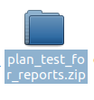
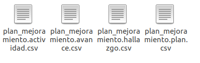
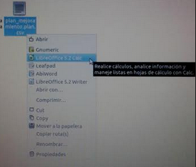
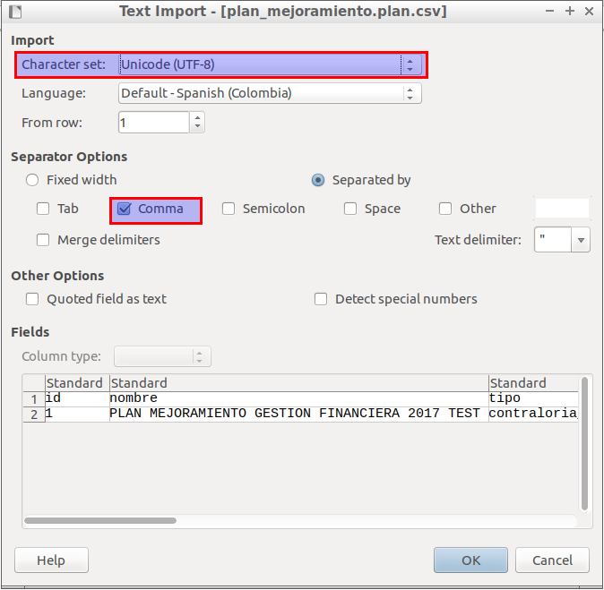
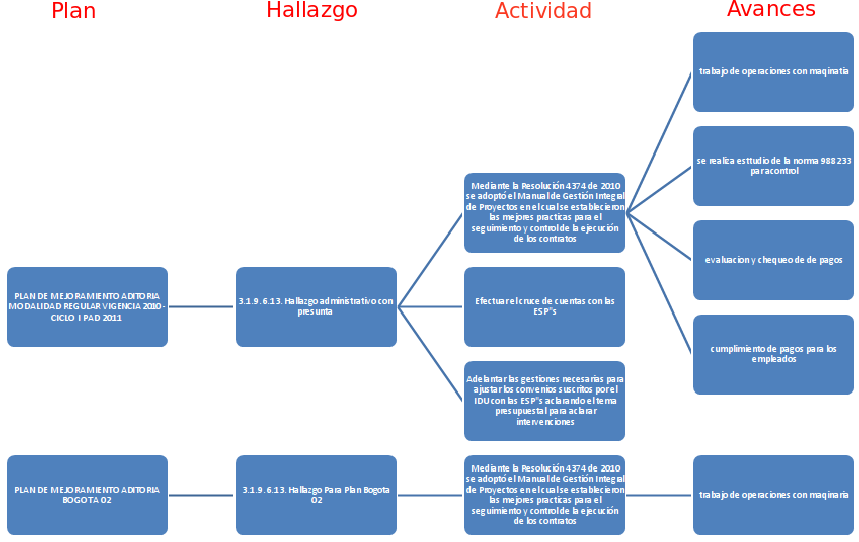

[[
Title: Cargue de Información por medio de archivos CSV al Sistema de Seguimiento y Control a los Planes de Mejoramiento (SCPM)
Author: José Javier Vargas Serrato
]]

Cargue de información por medio de archivos CSV al Sistema de Seguimiento y Control a los Planes de Mejoramiento (SÍSIFO)
===================================================================

Manual de usuario
============================

[TOC]

Introducción
--------------------------------
En este manual abordaremos todo lo pertinente para suministrar información  en las plantillas CSV que permitirá el cargue de información al Sistema de Seguimiento y Control a los Planes de Mejoramiento (SCPM).

Archivos Requeridos
----------------------------
Se proporcionará un archivo  llamado [plan_test_for_reports.zip](../data/plan_test_for_reports.zip) el cual contendrá los siguientes archivos:

plan_mejoramiento.plan.csv

plan_mejoramiento.hallazgo.csv

plan_mejoramiento.actividad.csv

plan_mejoramiento.avance.csv

*Figura 1. Archivo comprimido de los planes.*

*Figura 2. Planes al descomprimir el archivo en formato csv.*

Estos archivos representan cada uno de los objetos existentes en el  sistema de seguimiento y control a los planes de mejoramiento (SCPM) y en estos se suministrará la información que se desea cargar.

Archivos CSV
----------------------------
Para fines prácticos en el archivo [plan_test_for_reports.zip](../data/plan_test_for_reports.zip) 
suministrado, se encontrará la información correspondiente  a un plan con su debido hallazgo, actividades y avances que ilustraran la manera de cómo se debe ingresar la información a dichos archivos.

Los archivos CSV se deben abrir como se presenta en la Figura 3 y la Figura 4, dado que deben conservar su formato para evitar errores en la insercción del cargue másivo.

*Figura 3. Los archivos en formato csv se deben abri con LibreOffice 5.2 Calc.*

*Figura 4. En LibreOffice 5.2 Calc se debe usar el formato UTF-8, delimitado por comas.*

La Figura 5 ilustra la jerarquía  y contenido que poseen los archivos CSV que se encuentran en el archivo [plan_test_for_reports.zip](../data/plan_test_for_reports.zip)

*Figura 5. Jerarquía  y contenido de los archivos CSV.*

Archivo de los planes (plan_mejoramiento.plan.csv)
----------------------------

El Archivo plan_mejoramiento.plan.csv cuenta con los siguientes campos:

| CAMPO | DESCRIPCIÓN |
|--------|--------|
|     **id**   |  Código del plan correspondiente a un número entero unico e irrepetible.   |
|     **nombre**   |   Palabra que designa o identifica el plan.    |
|     **tipo**   |   Se refiere a la designación del plan sea: Interno, de la Contraloria de Bogotá (contraloria_bog) o de la Contraloria General (contraloria_gral).   |
|     **radicado_orfeo**   |   No utilizado.    |
|     **fecha_creacion**   |   Momento en el tiempo en el que se formulo el plan.     |
|     **dependencia**   |   Instancia de la Universidad responsable de ejecutar el plan.     |
|     **Auditor**   |   Nombre de usuario de la persona natural encargada del plan.     |
|     **origen**   |   No utilizado.     |
|     **sub_origen**   |   No utilizado.    |
|     **proceso_origen**   |   No utilizado.     |
|     **name_user**   |   Nombre completo del auditor.     |
|     **email_user**   |   Correo electrónico del auditor.     |
|     **area_user**   |   Dependencia en la que se desempeña el auditor.     |
|     **rol_user**   |   Representa el cargo del sujeto dentro del módulo. Sea 1 para auditor o 2 para ejecutor.    |

Archivo de los hallazgos (plan_mejoramiento.hallazgo.csv)
----------------------------

El Archivo plan_mejoramiento.hallazgo.csv cuenta con los siguientes campos:editar

| CAMPO | DESCRIPCIÓN |
|--------|--------|
|     **hallazgo_id**   |  Código del hallazgo correspondiente a un número entero unico e irrepetible.   |
|     **plan_id**   |  Código del plan correspondiente a un número entero unico e irrepetible.   |
|     **auditor**   |   Nombre de usuario de la persona natural que identifico el hallazgo.     |
|     **name_hallazgo**   |   Corresponde a un indice que identifica de manera única al hallazgo y lo enlaza con su descripción.    |
|     **capitulo**   |   Aspecto concreto correpondiente al código de auditoria asignado.    |
|     **dependencia**   |   Instancia de la Universidad responsable de ejecutar el plan.     |
|     **descripcion**   |   Observación que da justificación al motivo del hallazgo.     |

Archivo de la actividades (plan_mejoramiento.accion.csv)
----------------------------

El Archivo plan_mejoramiento.actividad.csv cuenta con los siguientes campos:editar

| CAMPO | DESCRIPCIÓN |
|--------|--------|
|     **actividad_id**   |  Código de la accion correspondiente a un número entero unico e irrepetible.   |
|     **hallazgo_id**   |  Código del hallazgo correspondiente a un número entero unico e irrepetible.   |
|     **tipo**   |   No utilizado.    |
|     **auditor**   |   Nombre de usuario del auditor que asigno la actividad a un ejecutor.     |
|     **dependencia**   |   Instancia de la Universidad responsable de ejecutar el plan.     |
|     **actividad**   |   Descripcion de la labor a ejecutar.     |
|     **objetivo**   |   No utilizado.    |
|     **indicador**   |   Indice que permite medir el progreso de la actividad.     |
|     **unidad_medida**   |   Cuantia que mide el indicador.    |
|     **meta**   |   Fin al que se dirige la actividad.    |
|     **recursos**   |   No utilizado.     |
|     **fecha_inicio**   |   Momento en el tiempo en el que se debe comenzar	 a ejecutar la acción.     |
|     **fecha_fin**   |   Momento en el tiempo máximo en el que se debe dar termino a la ejecución de la actividad.     |
|     **descripción**   |   No utilizado.     |
|     **denominación_medida**   |   No utilizado.     |
|     **ejecutor_login**   |   Nombre de usuario de la persona natural encargada de ejecutar la actividad.     |
|     **ejecutor_name**   |   Nombre completo del ejecutor.    |
|     **ejecutor_email**   |   Correo electrónico del ejecutor.     |
|     **ejecutor_rol**   |   Representa el cargo del sujeto dentro del módulo. Sea 1 para auditor o 2 para ejecutor.     |

Archivo de los avances (plan_mejoramiento.avance.csv)
----------------------------

El Archivo plan_mejoramiento.avance.csv cuenta con los siguientes campos:

| CAMPO | DESCRIPCIÓN |
|--------|--------|
|     **avances_id**   |  Código del avance correspondiente a un número entero unico e irrepetible.   |
|     **actividad_id**   |  Código de la accion correspondiente a un número entero unico e irrepetible.   |
|     **descripción**   |   Observación que da justificación y sustento al motivo del avance.    |
|     **fecha_corte**   |   Momento en el tiempo máximo en el que se debe dar termino a la ejecución del avance.     |
|     **estado**   |   Nivel de progreso del avance.     |
|     **porcentaje**   |   No utilizado.     |
|     **tipo_calificación**   |   No utilizado.     |

