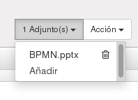
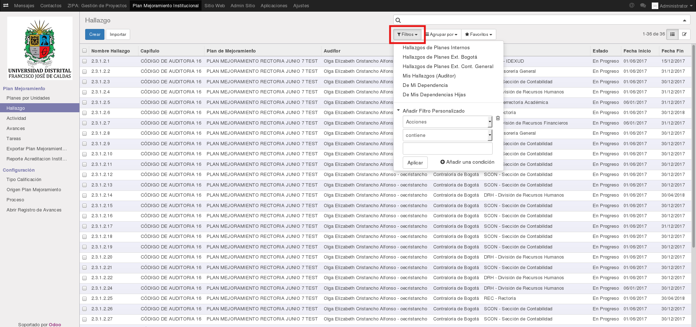
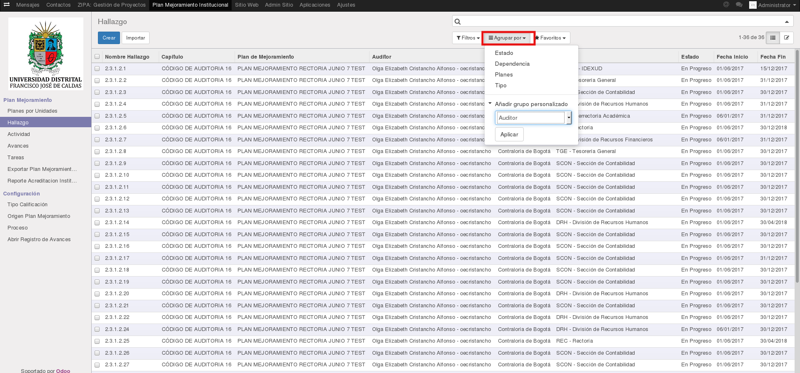

[[
title: Documento de Diseño de Alto Nivel del Proceso Registro y Seguimiento Planes de Mejoramiento
author: Marylin Sierra Forero
]]

Sistema de Seguimiento y Control a los Planes de Mejoramiento SÍSIFO (SCPM)
===================================================================

Manual de Herramientas de Usabilidad
============================

[TOC]

Introducción
--------------------------------

Este manual explica, sirve como guía para reconocer y emplear las herramientas de usabilidad que se presentan en el Sistema Síisfo, de esta forma facilitando los procesos que se generan en el Plan de Mejoramiento.

## Adjuntar Archivo

Como su nombre lo indica, esta herramienta permite adjuntar un archivo en la sección donde se encuentre, (es permitido cualquier formato). Cabe aclarar que esta opción depende de la configuración de los permisos de cada usuario. Se podrán agregar los archivos que se deseen aunque existan archivos adjuntos antes.

Para adjuntar un archivo será necesario dirigirse y hacer clic en el ítem el cual desea realizar dicho proceso, a continuación en la parte superior central encontrará un botón de selección llamado **Adjunto(s)**, al hacer clic aparece la opción **Añadir**:

Una vez se hace clic en **Añadir**, inmediatemante emergirá una ventana en la cual podra buscar y seleccionar dicho documento a adjuntar, finalmente hara clic en el botón Abrir:

Para concluir se podra evidenciar el número de archivos adjuntos en el botón de **Adjunto(s)**:

Para eliminar el o los archivos adjuntos de un ítem, sera necesario hacer clic en el botón **Adjunto(s)** donde se encontrará el listado de archivos adjuntos, al lado derecho de cada nombre del archivo aparece una caneca, la cual sirve para la eliminación del archivo adjunto, una vez echo clic en dicho icono, una ventana emergente solicitara confirmación del procedimiento (*¿Está seguro de querer eliminar este archivo adjunto?*), las opciones a elegir corresponden a dos botones Cancelar o Aceptar, si es elegida la primera no ocurrira nada, se cancelara como su nombre lo indica dicho proceso, de lo contrario si es elegida la segunda opción el archivo adjunto sera eliminado.

## Filtros

Como su nombre lo indica, esta herramienta permite filtrar, agrupar información y crear una búsqueda o filtro avanzado en la sección donde se encuentre.

Para filtrar información es necesario dirigirse a la parte superior al botón llamado **Filtros**, inmediatamente aparece un listado de los filtros predeterminados, se pueden seleccionar todos o los que se crean convenientes para el filtro o búsqueda de información.

Al final del listado se encuentra la opción **Añadir Filtro Personalizado**, como su nombre lo indica permite crear un filtro personalizado de acuerdo a las necesidades del usuario.

Si requiere añadir un filtro personalizado, podra asignar tres condiciones, si es necesario que el filtro contenga mas condiciones, se podran agregar haciendo clic en el botón **Añadir una condición**, para eliminar condiciones se hará clic en el icono de caneca que se encuentra en la parte izquierda.

### Agrupar por

Como su nombre lo indica, esta herramienta permite agrupar los ítems, de acuerdo a la necesidad del usuario. Inicialmente al hacer clic en el botón **Agrupar por**, se listaran las agrupaciones que se definieron predeterminadamente.

Se puede agrupar los ítems por grupos y subgrupos cuán cantidad de tipos de grupos existan:

Adicionalmente se puede **Añadir un Grupo Personalizado** haciendo clic en el botón del mismo nombre, una vez seleccionado el grupo se hara clic en el botón **Aplicar**, si se quieren eliminar se hara clic en X en la parte superior izquierda o se quitara la selección del nombre del grupo:

### Favoritos

Esta herramienta permite crear filtros y guardarlos, las opciones de configuración para estos son *Utilizar de forma predeterminada* o *Compartir con todos los usuarios*, solamente se puede elegir una opción. En el campo vacio se debe escribir el tipo de filtro, para este caso será Hallazgo, a continuación se debe hacer clic en el botón **Guardar**, posteriormente se podra evidenciar en el listado el filtro agregado:

Si se quieren eliminar los favoritos, se hara clic en el icono de caneca que se encuentra en la parte izquierda de cada nombre de un favorito, una vez echo clic en dicho icono, una ventana emergente solicitara confirmación del procedimiento (*Este filtro es global y será removido para todos los usuarios si continúa.*), las opciones a elegir corresponden a dos botones Cancelar o Aceptar, si es elegida la primera no ocurrira nada, se cancelara como su nombre lo indica dicho proceso, de lo contrario si es elegida la segunda opción el favorito sera eliminado.

## Historia de Comunicación

Las historias de comunicación se pueden encontrar en algunos ítems de acuerdo a las configuraciones predeterminadas y de permisos de los usuarios y módulos. Estas sirven para comunicarsen entre usuarios, mediante notas internas correspondientes a un ítem en cuestión y de esta forma poder llevar un seguimiento de los procedimientos que se generan en dicho proceso. Siempre se evidencian en la parte posterior de un ítem que se esta leyendo.

Para crear un **Nuevo Mensaje** es necesario hacer clic en el botón del mismo nombre, a continuación aparecera un campo en el cual se podrán escribir las observaciones pertinentes, a continuación se hará clic en el botón **Enviar**, inmediatamente quedara la observación en la historia.

Las herramientas que se presentan para un **Nuevo Mensaje** y **Registrar una nota interna**, son evniar un emoticon, adjuntar un archivo y crear una observación con estilos avanzados.

Para **Registrar una nota interna** es necesario hacer clic en el botón del mismo nombre, a continuación aparecera un campo en el cual se podrán escribir las observaciones pertinentes, a continuación se hará clic en el botón **Registrar**, inmediatamente quedara la observación en la historia.

Las historias de comunicación se pueden **Seguir**, haciendo clic en el botón del mismo nombre, adicionalmente se puede visualizar los seguidores que tiene esta historia, **Añadir Seguidores** o **Añadir Canales** (Estos dos ultimos varian de acuerdo a los permisos que tenga el usuario).

## Mensajes

Para revisar los mensajes que el usuario tiene, es necesario hacer clic en **Mensajes**, el cual se encuentra en la parte superior izquierda del Sistema Sísifo. En esta sección se encuentran listados los mensajes que fueron enviados al usuario, si no contiene mensajes aparece la siguiente información:

## Chat

El usuario cuenta con una sección de **Chat** en el cual podra comunicarse a tiempo real con otros usuarios del Sistema Sísifo. Esta sección se puede encontrar en el costado derecho parte superior, allí se listaran los chats que el usuario a tenido con otros miembros del Sistema.

