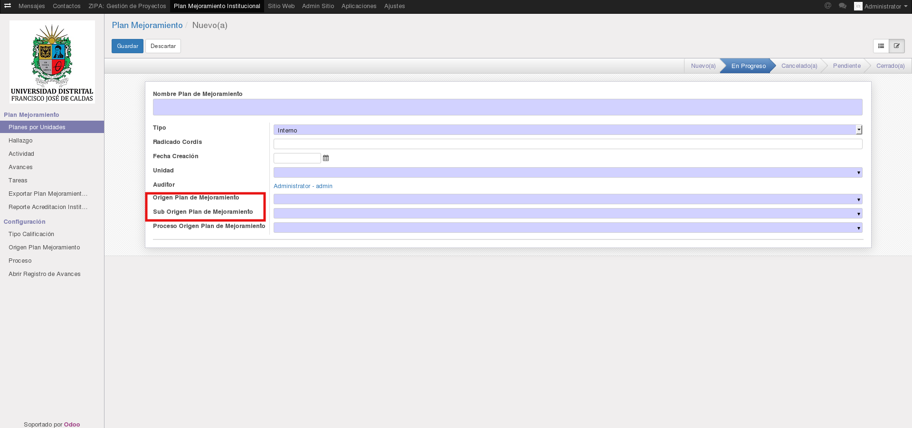
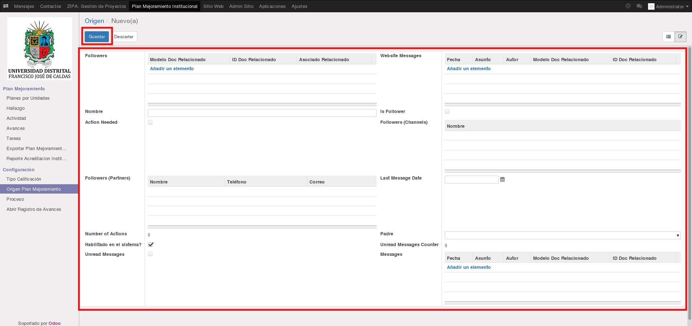
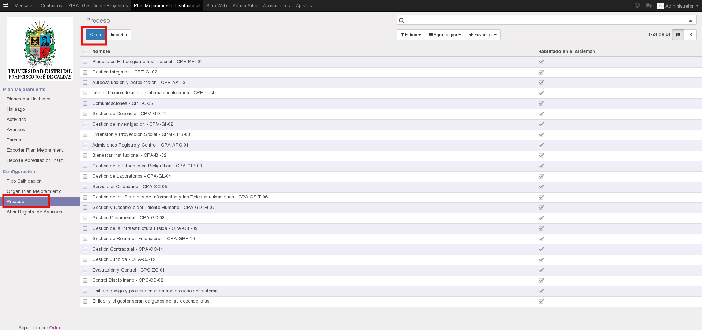
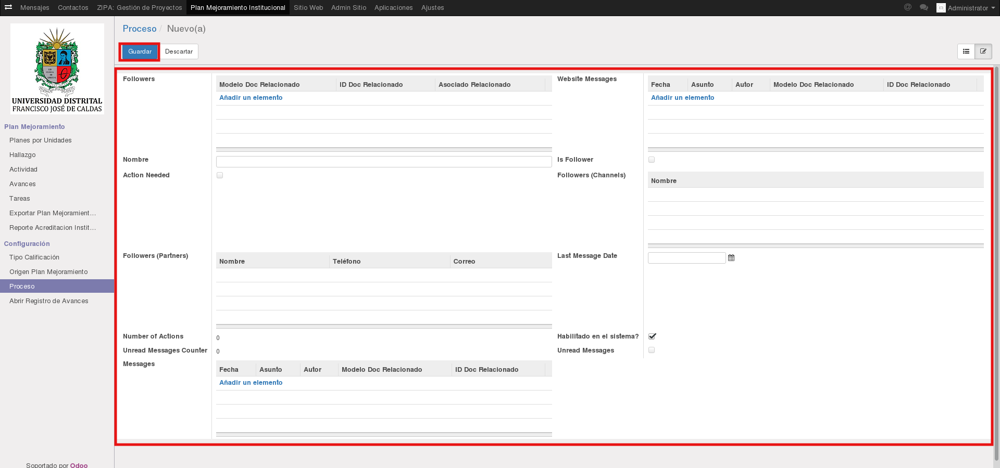
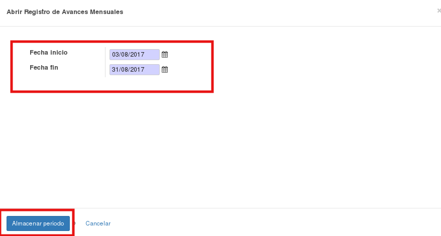

[[
title: Documento de diseño de Alto Nivel del Proceso Registro y Seguimiento Planes de Mejoramiento
author: Marylin Sierra Forero
]]

Sistema de Seguimiento y Control a los Planes de Mejoramiento SÍSIFO (SCPM)
===================================================================

Manual de Menú de Configuraciones
============================

[TOC]

Introducción
--------------------------------

Este manual explica las funcionalidades que contiene el **Menú de Configuraciones** del Sistema SÍSIFO, cabe aclarar que para cada tipo de rol puede llegar a ser diferente de acuerdo a los permisos que este tenga.

## Menú de Configuración

En esta sección el usuario podrá parametrizar los objetos Tipo Calificación, Origen Plan Mejoramiento, Proceso, Abrir Registro de Avances, cabe considerar que dichos objetos se encuentran involucrados en todo el proceso de seguimiento y control relacionados a los planes de mejoramiento.

### Tipo Calificación

El tipo de calificación es un valor establecido para que los usuarios oci establezcan en la cuantificación de los avances mensuales. Al existir 3 tipos de planes, existirán distintas calificaciones para cada uno de estos.

Click en el menú **Tipo Calificación**, se evidencia el listado de calificaciones existentes.

Click en el botón **Crear** como su nombre lo indica se utilizará para registrar un nuevo tipo de calificación. En este formulario se solicitan los campos Nombre Calificación, Estado y Tipo de Plan al que Aplica, estos dos ultimos campos son obligatorios asi mismo son de tipo select, es decir, que son campos de selección donde se debera escoger de acuerdo a la necesidad que se desarrolla, una vez elegidos sera necesario hacer clic en el botón Guardar.

### Origen Plan Mejoramiento

El objeto **Origen Plan Mejoramiento** solo está involucrado en los planes internos. La función de parametrizar estos objetos, es fundamentalmente para que el usuario **OCI** realice el registro del plan, de esta forma no tiene necesidad de crearlos, sino que al contrario, utilizará los ya existentes.

A continuación se evidencia que los campos **Origen Plan de Mejoramiento** y  **Sub Origen Plan de Mejoramiento**, las opciones que se pueden seleccionar de dichos campos provienen de la parametrización que realizada en el menú de **Origen Plan Mejoramiento**.

Click en el botón **Crear** como su nombre lo indica se utilizará para registrar un nuevo Origen Plan de Mejoramiento. En este formulario se solicitan los campos que se visualizan a continuación.

Una vez seleccionados los campos se debe hacer clic en el botón Guardar, en este instante el origen de plan de mejoramiento ha sido creado y se podra encontrar en el listado que aparece inicialmente.

### Proceso

En esta sección se encontrarán los procesos en un listado con nombre y se encuentra habilitado en el sistema. Para ***Crear*** click en el menú **Proceso**, a continuación Click en el botón **Crear**.

Una vez hecho el click en el botón Crear aparecera el siguiente formulario, terminado de diligenciar dicho solicitud sea necesario hacer click en el botón Guardar, en este instante el proceso ha sido creado y se podra encontrar en el listado que aparece inicialmente.

### Abrir Registro de Avances

En esta sección el usuario administrador o los usuarios que tengan el permiso para habilitar las fechas de creación de avances para cada mes. Se deberá hacer click en **Abrir Registro de Avances** en la parte izquierda inferior de la pantalla, a continuación aparece una ventana emergente donde se asignará la Fecha Inicio y la Fecha Fin, ambos campos con obligatorios, con formato date, es decir, solo permitiran el ingreso de fechas. Es necesario tener en cuenta que no es permitido guardar una fecha menor a la actual para el campo fecha Inicio.

