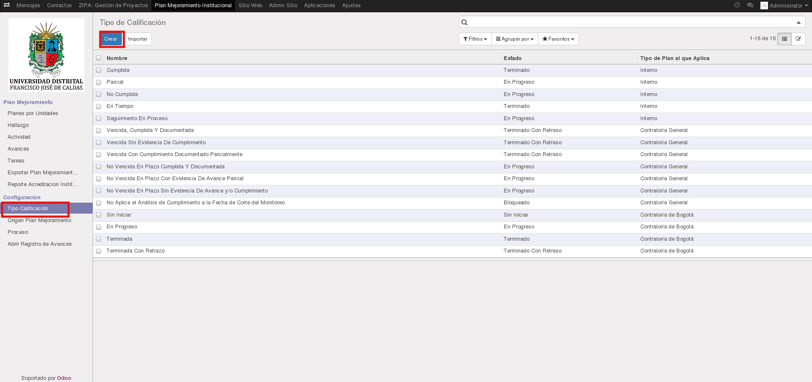
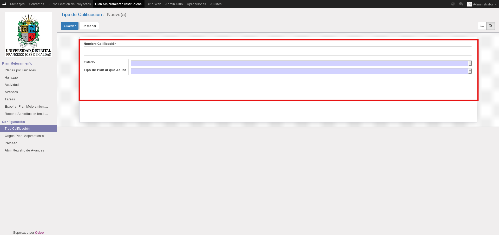
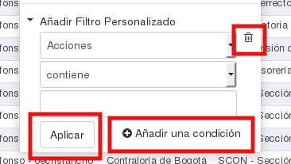
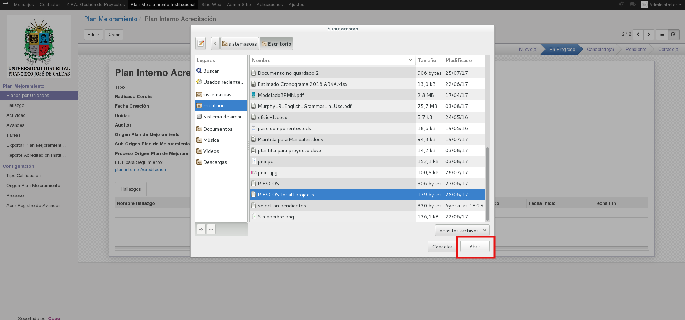
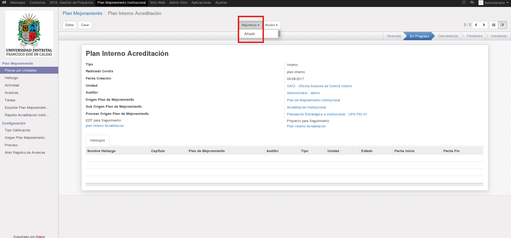

[[
title: Documento de diseño de Alto Nivel del Proceso Registro y Seguimiento Planes de Mejoramiento
author: José Javier Vargas Serrato
]]
Sistema de Seguimiento y Control a los Planes de Mejoramiento (SCPM)
===================================================================

Manual de usuario Super Admin
============================

[TOC]

Introducción
--------------------------------
En esta sección abordaremos algunas funcionalidades del usuario **Super Admin** en el sistema Odoo, este usuario es muy distinto al usuario **administrador** del módulo planes de mejoramiento. El primero abarca la parte administrativa del sistema Odoo en general, el segundo abarca la administración del módulo únicamente de planes de mejoramiento.

## Menú de Configuración:

Este menú es de uso exclusivo por los Usuarios Administrador. El usuario podrá parametrizar los objetos Tipo Calificación, Origen Plan Mejoramiento, Proceso, Abrir Registro de Avances, cabe considerar que dichos objetos se encuentran involucrados en todo el proceso de seguimiento y control relacionados a los planes de mejoramiento.

### Tipo Calificación

El tipo de calificación es un valor establecido para que los usuarios oci establezcan en la cuantificación de los avances mensuales. Al existir 3 tipos de planes, existirán distintas calificaciones para cada uno de estos.

Click en el menú **Tipo Calificación**, verá el listado de calificaciones existente.

Click en el botón **Crear** para registrar un nuevo tipo de calificación.

Ingresamos un nombre descriptivo para la calificación.

En el campo **Estado** seleccione uno de los estados genéricos en el que pueda estar el que está registrando. Para este ejemplo  El estado a registrar es “Cumplida Vencida” el esto genérico que vamos a seleccionar es el Terminado con retraso.

En el campo **Tipo de Plan al que Aplica**  seleccionamos uno de los 3 tipos de planes al que queremos que aplique la calificación.

Click en el botón **Guardar** para finalizar.

### Origen Plan Mejoramiento
El objeto **Origen Plan Mejoramiento** solo está involucrado en los planes internos. La función de parametrizar este objetos,  es para cuando el usuario **OCI** realice el registro del plan, no tenga que crearlos, sino utilizar los ya existentes.

En la siguiente imagen podemos ver los campos **Origen Plan de Mejoramiento** y  **Sub Origen Plan de Mejoramiento**, las opciones que se pueden seleccionar de dichos campos provienen de la parametrización que se hace en el menú de **Origen Plan Mejoramiento**.

##### Crear Origen:
Para crear un **Origen Plan Mejoramiento**  simplemente debes diligenciar **únicamente** el campo nombre.
Click en el botón **Guardar**

Como podemos ver ya se encuentra registrada.

##### Crear Sub-Origen:
Para crear un **Sub Origen Plan Mejoramiento**  como su nombre lo indica pertenece a un **Origen**.  Simplemente debemos diligencia el campo **Nombre** con el nombre que deseamos para el sub-origen y en el campo **Padre** debemos seleccionar uno de los **Orígenes** ya existentes.

En la siguiente imagen vemos cómo al seleccionar el origen creado, “Origen demo tutorial” en el campo **Sub Origen ….** nos lista los sub-orígenes creados para este.

### Procesos
El objeto **Proceso** solo está involucrado en los planes internos.

Para Crear click en el menú **Proceso**  y luego Click en **Crear**

Diligenciar el campo **Nombre**  y click en **Guardar**

### Abrir Registros de Avances

En esta sección el usuario administrador habilita las fechas de creación de avances para cada mes.

Para esto click en el menú **Abrir Registro de Avances Mensuales** y diligenciar los campos **Fecha Inicio**, **Fecha Fin**

