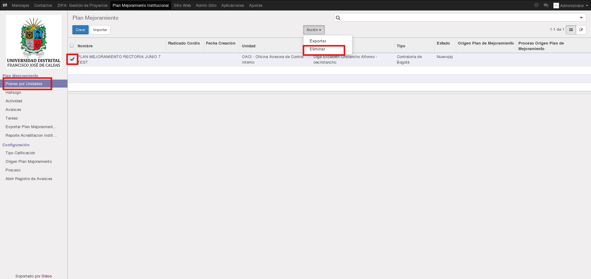
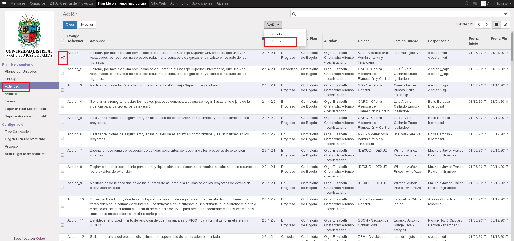

[[
title: Documento de Diseño de Alto Nivel del Proceso Registro y Seguimiento Planes de Mejoramiento
author: José Javier Vargas Serrato
]]

Sistema de Seguimiento y Control a los Planes de Mejoramiento SÍSIFO (SCPM)
===================================================================

Manual de Usuario Administrador
============================

[TOC]

Introducción
--------------------------------

Este manual explica las funcionalidades que el Usuario Administrador tiene permitido realizar en el módulo Planes de Mejoramiento del Sistema SÍSIFO.

## Planes por Unidades

Este apartado como el de **Hallazgo**, **Actividad** y **Avances** el Usuario Administrador podrá crear, leer, eliminar y exportar objetos.  La creación, lectura y exportación se encuentran detallados en el apartado de usuarios. [Registrar Plan Interno](/planes_de_mejoramiento/documentacion/usuario_oci.html)

Es necesario seleccionar el **Plan** que se desea eliminar, una vez elegido dicho elemento por medio del checkbox aparecerá en la parte superior de la página un botón llamado "Acción", el cual tiene dos opciones Exportar o Eliminar, para eliminar se debe seleccionar como su nombre lo indica la opción "Eliminar", a continuación aparece una ventana emergente con la siguiente pregunta: "¿Realmente desea remover estos registros?", si elige la opción "Cancelar" no realizará ninguna acción, de lo contrario si elige la opción "Aceptar" es eliminado el ítem seleccionado.

## Hallazgo

Es necesario seleccionar el **Hallazgo** que se desea eliminar, una vez elegido dicho elemento por medio del checkbox aparecerá en la parte superior de la página un botón llamado "Acción", el cual tiene dos opciones Exportar o Eliminar, para eliminar se debe seleccionar como su nombre lo indica la opción "Eliminar", a continuación aparece una ventana emergente con la siguiente pregunta: "¿Realmente desea remover estos registros?", si elige la opción "Cancelar" no realizará ninguna acción, de lo contrario si elige la opción "Aceptar" es eliminado el ítem seleccionado.

Para la creación, lectura de hallazgo visitar el siguiente link.  [Hallazgo](/planes_de_mejoramiento/documentacion/usuario_oci.html)

## Actividad

Es necesario seleccionar la **Actividad** que se desea eliminar, una vez elegido dicho elemento por medio del checkbox aparecerá en la parte superior de la página un botón llamado "Acción", el cual tiene dos opciones Exportar o Eliminar, para eliminar se debe seleccionar como su nombre lo indica la opción "Eliminar", a continuación aparece una ventana emergente con la siguiente pregunta: "¿Realmente desea remover estos registros?", si elige la opción "Cancelar" no realizará ninguna acción, de lo contrario si elige la opción "Aceptar" es eliminado el ítem seleccionado. Cabe aclarar que las Actividades que se encuentren en estado "Cancelada" no podrán ser eliminadas.

Para la creación, lectura de Actividad visitar el siguiente link. [Actividad](/planes_de_mejoramiento/documentacion/usuario_oci.html)

## Avances

Es necesario seleccionar el **Avance** que se desea eliminar, una vez elegido dicho elemento por medio del checkbox aparecerá en la parte superior de la página un botón llamado "Acción", el cual tiene dos opciones Exportar o Eliminar, para eliminar se debe seleccionar como su nombre lo indica la opción "Eliminar", a continuación aparece una ventana emergente con la siguiente pregunta: "¿Realmente desea remover estos registros?", si elige la opción "Cancelar" no realizará ninguna acción, de lo contrario si elige la opción "Aceptar" es eliminado el ítem seleccionado.

## Exportar Plan Mejoramiento a XLS

Para exportar un plan de mejoramiento en formato xls es necesario hacer clic en el botón Exportar Plan Mejoramiento a XLS, una vez se realiza dicho procedimiento aparecerá una ventana emergente donde se solicita el Reporte si es Interno, Contraloría General o Contraloría de Bogotá, este campo es obligatorio para la generación del reporte en Excel, a continuación se solicita Fecha Inicial Acción y Fecha Final Acción (estos dos últimos campos son de tipo date, es decir, que solo admiten fechas), Tipo Calificación Avance si no existen opciones se pueden crear, finalmente esta la opción Agrupar Reporte es un campo de selección, una vez se agrega la información deseada, se procederá con la Exportación a XLS mediante el botón llamado de la misma forma, para culminar, aparece una ventana emergente donde saldra la opción Descargar el archivo. 

