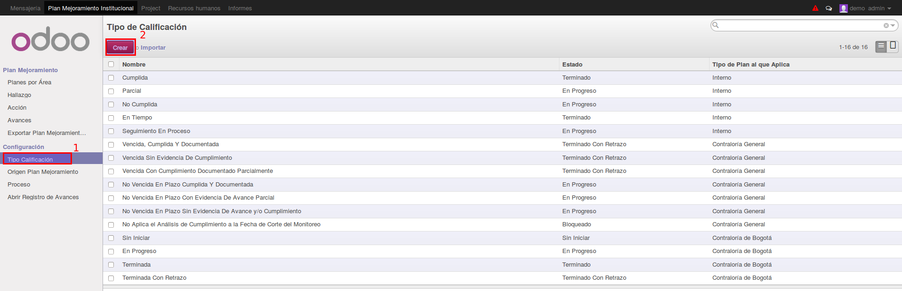
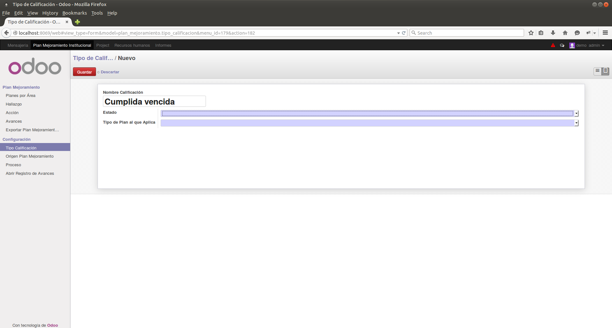
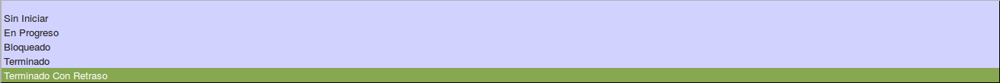
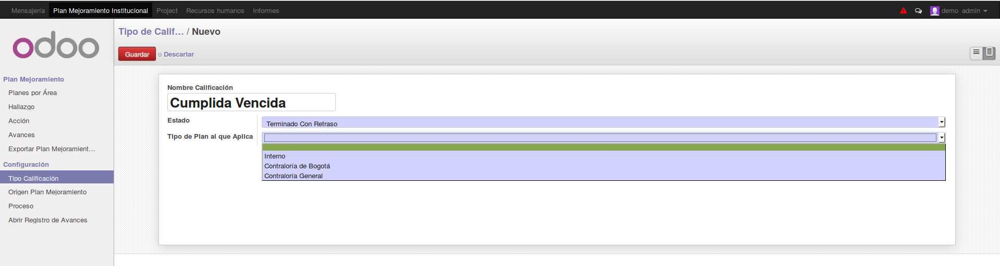
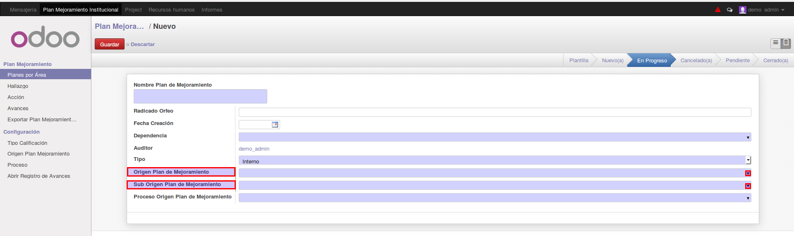
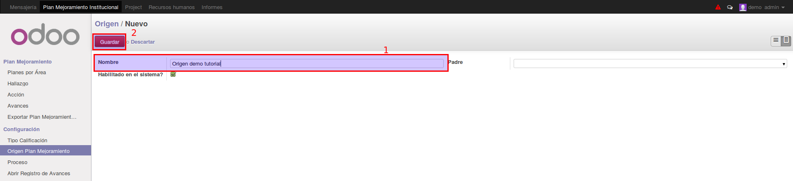
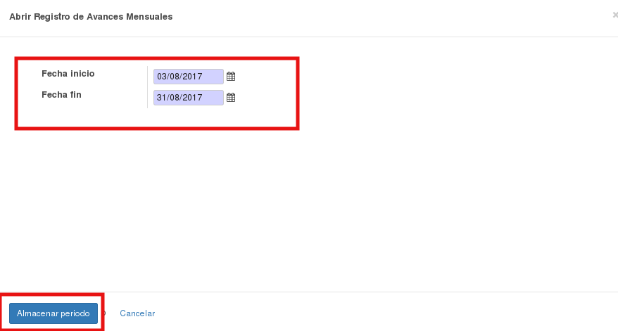

[[
title: Documento de diseño de Alto Nivel del Proceso Registro y Seguimiento Planes de Mejoramiento
author: José Javier Vargas Serrato
]]
Sistema de Seguimiento y Control a los Planes de Mejoramiento (SCPM)
===================================================================

Manual de usuario Administrador
============================

[TOC]

Introducción
--------------------------------
En esta sección abordaremos las distintas funcionalidades del usuario Administrador en el módulo de planes de mejoramiento del sistema Odoo.

## Planes por Área
En esta apartado como en el de **Hallazgos**, **Acciones** y **Avances** el usuario Administrador podrá crear, leer, eliminar y exportar objetos.  La creación, lectura y exportación ya se detalló en el apartado de usuarios. [Registrar Plan Interno](/planes_de_mejoramiento/documentacion/usuario_oci.html)

En esta sección explicaremos la eliminación de registros del objeto **Plan**.

## Hallazgo
De igual manera, como se eliminaron los registros de **planes por área** se elimina los registros de hallazgos.

Para la creación, lectura de hallazgo visitar el siguiente link.  [Hallazgo](/planes_de_mejoramiento/documentacion/usuario_oci.html)

## Acciones
De igual manera, como se eliminaron los registros de **planes por área** se elimina los registros de hallazgos.

Para la creación, lectura de Acciones visitar el siguiente link. [Acciones](/planes_de_mejoramiento/documentacion/usuario_oci.html)

## Avances
De igual manera como como se eliminan los registros de planes por área se haze con los de avances.
[falta]

## Menú de configuraciones:
Este menú es de uso exclusivo de los usuarios administradores. En este, el usuario podrá parametrizar los objetos Tipo Calificación, Origen Plan Mejoramiento, Procesos, Abrir Registros de Avances, objetos que están involucrados en todo el procesos de seguimiento y control a los planes de mejoramiento.

### Tipo Calificación
El tipo de calificación es un valor establecido para que los usuarios oci establezcan en la cuantificación de los avances mensuales. Al existir 3 tipos de planes, existirán distintas calificaciones para cada uno de estos.

Click en el menú **Tipo Calificación**, verá el listado de calificaciones existente.

Click en el botón **Crear** para registrar un nuevo tipo de calificación.

Ingresamos un nombre descriptivo para la calificación.

En el campo **Estado** seleccione uno de los estados genéricos en el que pueda estar el que está registrando. Para este ejemplo  El estado a registrar es “Cumplida Vencida” el esto genérico que vamos a seleccionar es el Terminado con retraso.

En el campo **Tipo de Plan al que Aplica**  seleccionamos uno de los 3 tipos de planes al que queremos que aplique la calificación.

Click en el botón **Guardar** para finalizar.

### Origen Plan Mejoramiento
El objeto **Origen Plan Mejoramiento** solo está involucrado en los planes internos. La función de parametrizar este objetos,  es para cuando el usuario **OCI** realice el registro del plan, no tenga que crearlos, sino utilizar los ya existentes.

En la siguiente imagen podemos ver los campos **Origen Plan de Mejoramiento** y  **Sub Origen Plan de Mejoramiento**, las opciones que se pueden seleccionar de dichos campos provienen de la parametrización que se hace en el menú de **Origen Plan Mejoramiento**.

##### Crear Origen:
Para crear un **Origen Plan Mejoramiento**  simplemente debes diligenciar **únicamente** el campo nombre.
Click en el botón **Guardar**

Como podemos ver ya se encuentra registrada.

##### Crear Sub-Origen:
Para crear un **Sub Origen Plan Mejoramiento**  como su nombre lo indica pertenece a un **Origen**.  Simplemente debemos diligencia el campo **Nombre** con el nombre que deseamos para el sub-origen y en el campo **Padre** debemos seleccionar uno de los **Orígenes** ya existentes.

En la siguiente imagen vemos cómo al seleccionar el origen creado, “Origen demo tutorial” en el campo **Sub Origen ….** nos lista los sub-orígenes creados para este.

### Procesos
El objeto **Proceso** solo está involucrado en los planes internos.

Para Crear click en el menú **Proceso**  y luego Click en **Crear**

Diligenciar el campo **Nombre**  y click en **Guardar**

### Abrir Registros de Avances

En esta sección el usuario administrador habilita las fechas de creación de avances para cada mes.

Para esto click en el menú **Abrir Registro de Avances Mensuales** y diligenciar los campos **Fecha Inicio**, **Fecha Fin**

