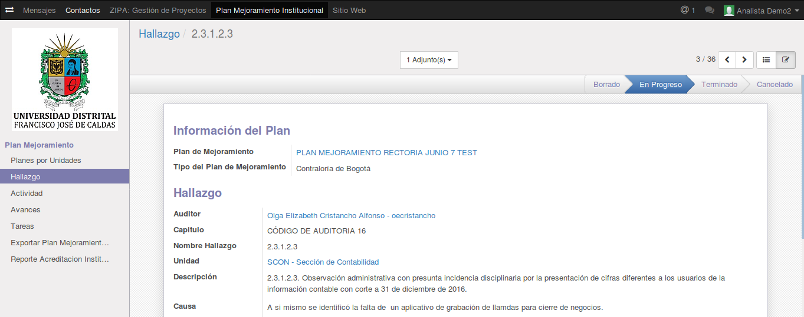
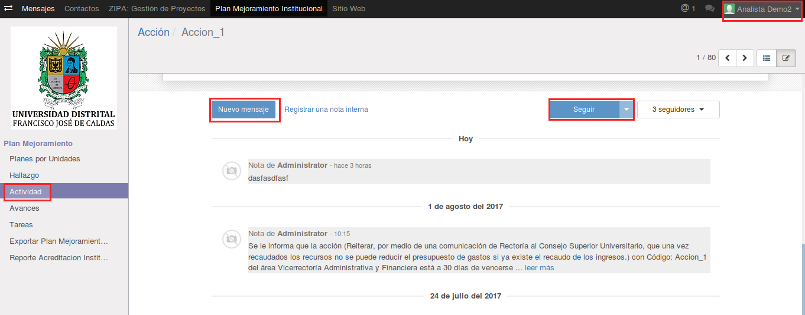
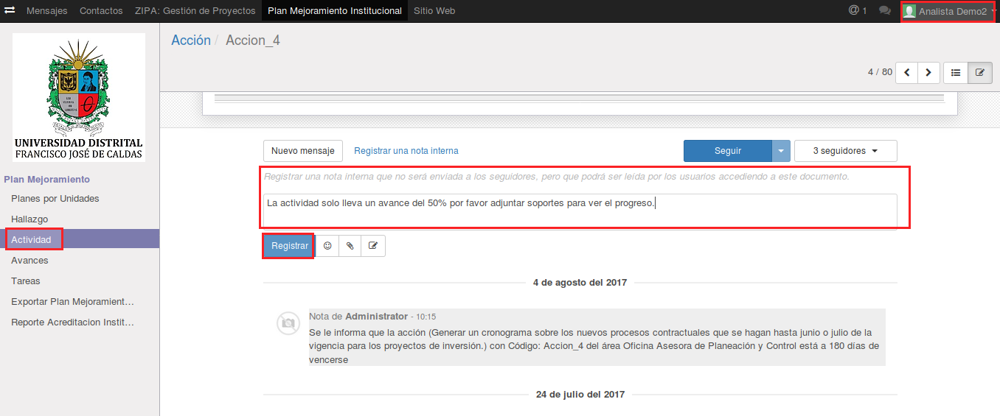
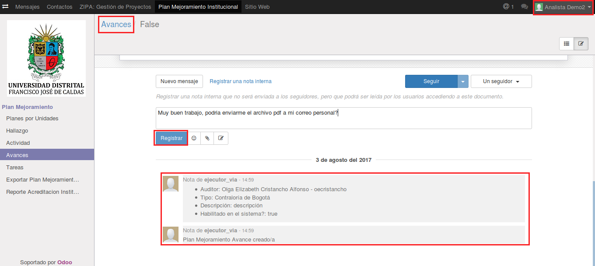

[[
title: Documento de diseño de Alto Nivel del Proceso Registro y Seguimiento Planes de Mejoramiento
author: José Javier Vargas Serrato
]]
SÍSIFO: Sistema de Seguimiento y Control a los Planes de Mejoramiento
===================================================================

Manual de usuario Analista
============================

[TOC]

Introducción
--------------------------------
En esta sección abordaremos las distintas funcionalidades del usuario Analista en el módulo de planes de mejoramiento del sistema Odoo.

## Planes por Área

En esta apartado el usuario **Analista** podrá ver todos los planes de las distintas áreas del instituto, ya que función es de acompañamiento y seguimiento.

Como podemos ver la opción para crear planes no está habilitada.

Al seleccionar un plan específico para ver el detalle de su información, tampoco aparecen los botones de edición en la parte superior.

## Hallazgo

De igual manera como en el apartado de **Planes por Área** en el de **Hallazgos** el usuario **Analista** podrá leer todos los hallazgos.

Detalle de **Hallazgo**

## Actividades

En esta sección el usuario **Analista** interviene directamente con las áreas involucradas de una actividad determinada. Este por medio del menú **Historia de Comunicación** podrá dejar sus observaciones contribuyendo con el éxito de la acción y minimizando el riesgo.

Una vez seleccionada la Actividad a comentar. Dirigirse a la parte inferior de la pantalla donde se encuentra el menú  **Historia de Comunicación**. Clic en **Nuevo mensaje**

El usuario analista podra escribir la observación en la sección inferior de **Historia de la Comunicación**.

## Avances

En este apartado el **Analista** también podra realizar observaciones a los avances en la sección inferior de **Historia de la Comunicación**.

