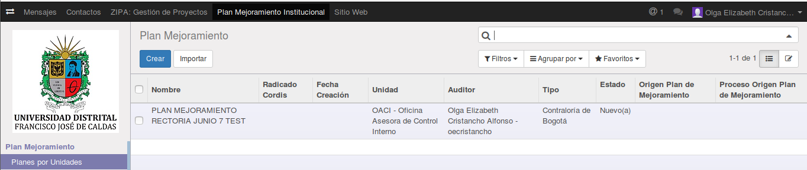
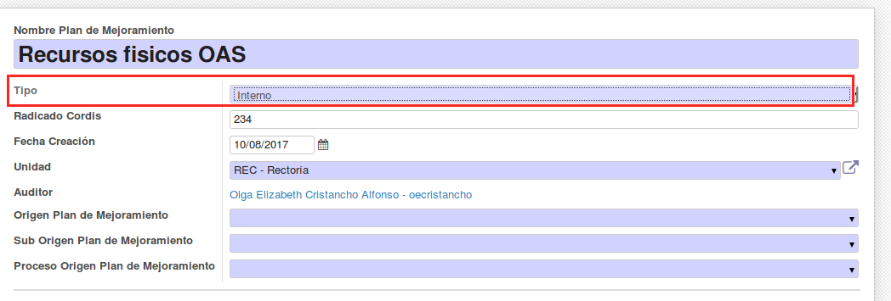
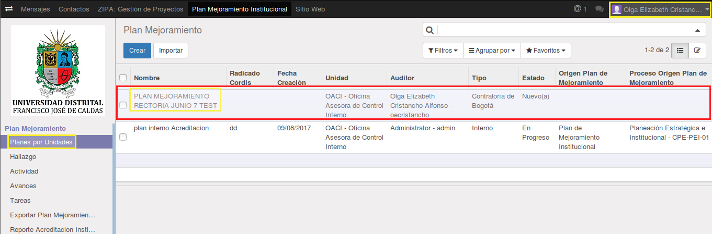
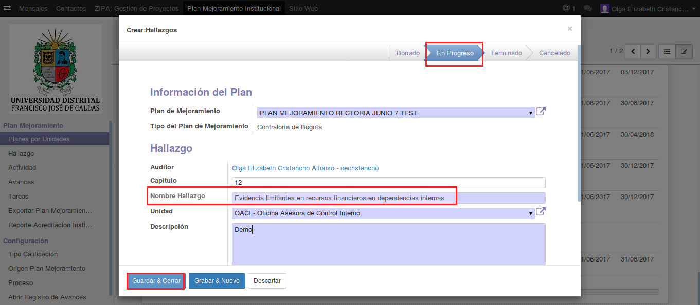
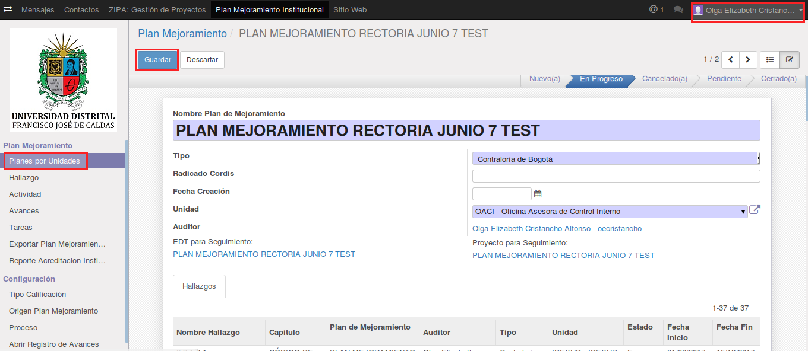
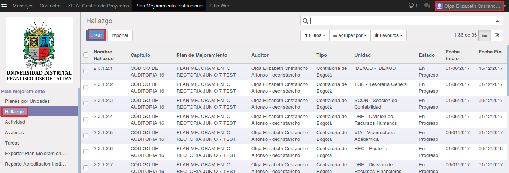
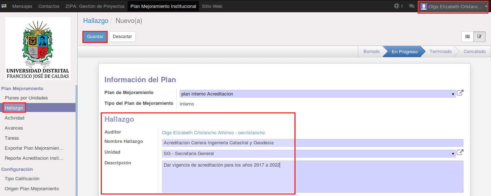

[[
title: Documento de diseño de Alto Nivel del Proceso Registro y Seguimiento Planes de Mejoramiento
author: José Javier Vargas Serrato
]]
SÍSIFO: Sistema de Seguimiento y Control a los Planes de Mejoramiento
===================================================================

Manual de usuario Auditor
============================

[TOC]

Introducción
--------------------------------

En esta sección abordaremos las distintas funcionalidades del usuario Auditor en el módulo de planes de mejoramiento del sistema SÍSIFO.

Menú principal
----------------------------

El menú principal se encuentra en la parte superior de la interfaz de inicio del sistema SÍSIFO definido como “Plan Mejoramiento Institucional” en este encontraremos todo lo correspondiente al seguimiento y control de los planes internos y externos “Contraloría de Bogotá y Contraloría General ”. Esto se ilustra en la siguiente imagen:

*Figura 1. Menu principal.*

Una vez demos click en el menú principal aparecerá una sección en la parte izquierda que contendrá todos los objetos que intervienen en el proceso de control y seguimiento de los planes de mejoramiento "Hallazgo, Actividad, Avances".  Ver la siguiente imagen.

*Figura 2. Menu plan de Mejoramiento.*

## Planes por Unidad

En esta apartado el usuario Auditor podrá crear y editar los planes ya sean internos o externos “Contraloria Interna, Contraloría de Bogotá, Contraloría General”.

Todos los usuarios Auditor podrán ver los planes y demás objetos pertenecientes al plan (Hallazgos, Actividades) que hayan creado sus colegas OCI, pero solo podrá editar los de su pertenencia.

Cuando un usuario Auditor crea un plan, el campo **Auditor** se alimenta automáticamente con el nombre del usuario que está haciendo la operación. Con esto se garantiza que sea de su pertenencia.

Para registrar un plan interno o externo, podrá seleccionar el campo **Tipó** y este proporciona las tres opciones a elegir.

**Nota 01:**
**Dependiendo la selección del campo tipo en el objeto plan; los objetos relacionados “Hallazgos, Acciones” y el mismo plan, solicitará más campos o menos, esto debido a las características de cada formato para dicho plan.**

### Registrar Plan Interno 

Para crear el plan damos clic en la opcion *"Crear"* y en el menu desplegable de la opción **"tipo"** seleccionamos **Interno**.

*Figura 3. Registrar un plan interno.*

### Registrar Plan Externo Contraloría Bogotá

En el menu desplegable de la opción **"tipo"** seleccionamos **Contraloria de Bogota**.

*Figura 4. Registrar un plan de la Contraloria de Bogota.*

### Registrar Plan Externo Contraloría General

En el menu desplegable de la opción **"tipo"** seleccionamos **Contraloria General**.

*Figura 5. Registrar un plan de la Contraloria General.*

## Hallazgo

En esta sección el usuario Auditor podrá crear y editar hallazgos asociados o pertenecientes a un plan de mejoramiento. Esta operación podrá realizarse de dos manera:

### Registrar Hallazgo Desde el Módulo Plan:

Una vez registrado el plan de mejoramiento o los planes, seleccionamos a cual de todos los existentes deseamos agregarle  hallazgos.

*Figura 6. Registrar hallazgo desde el plan.*

Click sobre este y luego en el botón Editar. Se nos habilitará la sección de hallazgos en la parte inferior como en la Figura 8.

*Figura 7. Sección de información general del plan.*

*Figura 8. Añadir un hallazgo desde el plan.*

Una vez demos click sobre **Adicionar un elemento** el sistema nos proporcionará el formulario de registro para los hallazgos. Este formulario cuenta con una sección descriptiva del plan al cual va a pertenecer este hallazgo, sección "Información del plan" en la parte superior. En la parte inferior encontramos los campos correspondiente al hallazgo.

*Figura 9. Diligenciar formulario del hallazgo.*

Para finalizar debe dar click en **Guardar y Cerrar** de la ventana de **Hallazgo **

*Figura 10. Guardar y cerrar la ventana hallazgo.*

Luego Click en **Guardar** en la ventana del **Plan**

*Figura 11. Guardar desde la ventana del plan.*

### Registra Hallazgo:

La otra forma de registrar hallazgo es desde su menú. Simplemente damos click en el menú **Hallazgo** luego Click en **Crear**  como lo muestra la siguiente imagen.

*Figura 12. Crear hallazgo desde su módulo.*

Después de esto el sistema nos mostrará el formulario de hallazgo para diligenciar. El campo **Plan Mejoramiento** nos permite elegir el plan al cual pertenecerá el hallazgo a crear.

*Figura 13. Diligenciar y guardar hallazgo desde su módulo.*

## Actividad

En esta sección el usuario Auditor podrá cambiar el estado de las Actividades asociados o pertenecientes a un Hallazgo, dandolas por **Terminadas** o **Canceladas**, esto dependiendo del cumplimiento y culminación de los Avances que sustenta la Actividad.

*Figura 14. Actividades desde su módulo.*

Luego de dar clic sobre la actividad podremos visualizar la información general de la misma y su estado.

*Figura 15. Información y estado de la actividad.*

Podra hacer seguimiento a la actividad, esto quiere decir que puede consultar las actividades, agruparlas o simplemente comentarlas en la seccion de **Historia de Comunicación** que se encuentra en la parte inferir de cada actividad. Por ninguna razon podra editar la infromación de la actividad creada.

Los cambios o actualizaciones que se realizen sobre cada Actividad se reportarán en el menú **Historia de Comunicación**, donde se pueden añadir comentarios y con la opción "Seguir" es posible que el usuario que se registre como seguidor reciba estas mismas notificaciones del progreso que se haga de la actividad al correo.

*Figura 16. Seguimiento de la actividad.*

## Avances

### Calificar Avances

 Una vez  creado el avance por el usuario jefe o por el usuario ejecutor, el usuario **Auditor** deberá calificarlo, Para esto deberá ingresar al módulo de Avances, seleccionar el avance que desea calificar y click sobre este. En la siguiente imagen se ilustra la manera de hacerlo.

1. click en el módulo de avances

2. click en el registro de avances que se desea calificar

3. click en la opción Editar

*Figura 17. Avances desde su módulo.*

Luego de dar clic sobre el avance podremos visualizar la información de la actividad, la cual contiene el avance con información sobre las fechas de desarrollo y la aprobación del jefe de la unidad.

*Figura 18. Informacion general del avance.*

Luego de esto el sistema mostrará la información del avance. Si damos click en el botón **Editar** nos permitirá ingresar información en la sección de **Calificación** esto corresponde a los campos **Tipo Calificación**, **% de avance** y **Observaciones**. Luego de esto Click en Guardar y hemos realizado la calificación al avance.

*Figura 19. Calificación del avance.*

El sistema reportará la calificación en el menú **Historia de Comunicación** para que los usuarios que puedan ver los avances, puedan tener un historial de las calificaciones. De igual manera al usuario  que haya creado el avance se le reportará la calificación en el menú de mensajes.

*Figura 20. Seguimiento del avance.*

