[[
title: Documento de diseño de Alto Nivel del Proceso Registro y Seguimiento Planes de Mejoramiento
author: José Javier Vargas Serrato
]]
SÍSIFO: Sistema de Seguimiento y Control a los Planes de Mejoramiento
===================================================================

Manual de usuario Ejecutor
============================

[TOC]

Introducción
--------------------------------
En esta sección abordaremos las distintas funcionalidades del usuario Ejecutor en el módulo de planes de mejoramiento del sistema SÍSIFO.

## Planes por Unidades

En esta apartado el usuario Ejecutor podrá ver todos los planes que existan de su unidad y demas unidades. Podrá hacer uso de los filtros y agrupaciones para solo ver los que le interesa.

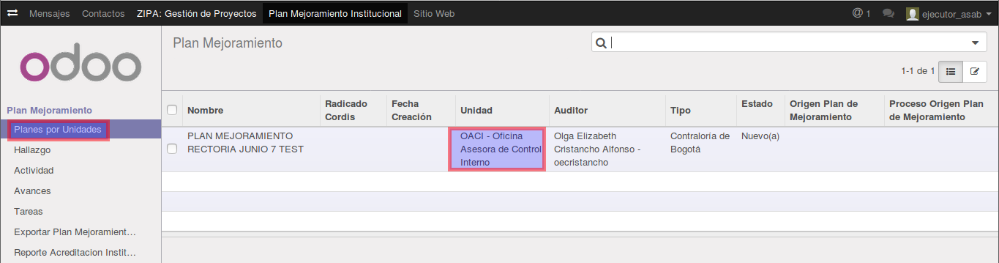

Si damos click sobre alguno de los registro de planes que aparecen en el listado podremos acceder a la información de este.

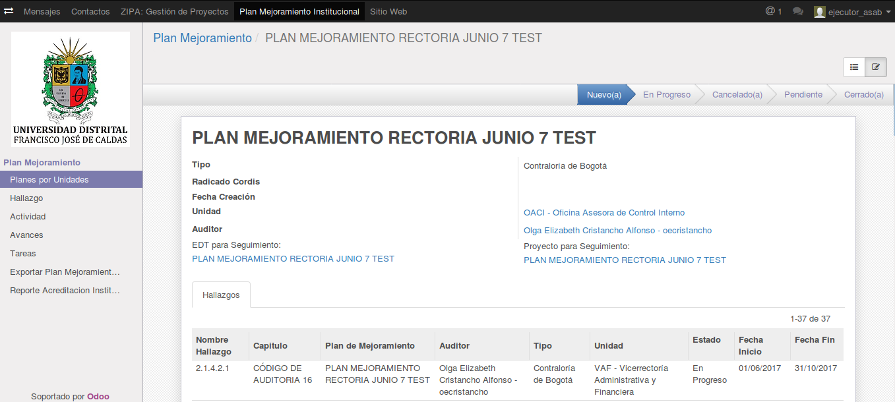

## Hallazgo

De igual manera podra ver todos los Hallazgo de las distintas unidades.

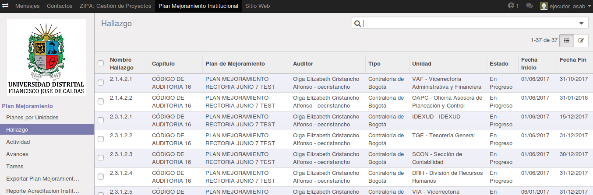

## Actividades

Una de las funciones primordiales de usuario **Ejecutor** es el registro de las activiades; que desarrollará la unidad para dar solución al hallazgo.

### Crear Actividad:

Una vez nos encontramos en el módulo de Plan de Mejoramiento Institucional damos clic sobre el menu a la izquierda sobre **"Actividad"**, el sistema nos mostrará una ventana dedicada a las Activiades donde damos clic en la opción **"Crear"**.

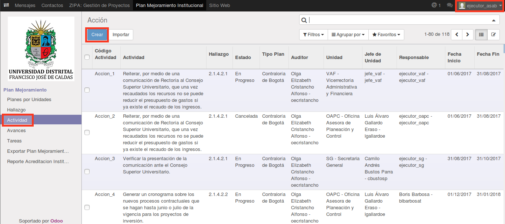

Debemos indicar el **hallazgo** del que hará parte la actividad, encontraremos un sección de información perteneciente la hallazgo seleccionado y tambien una sección informativa del plan del cual hace parte el hallazgo seleccionado. Debemos diligenciar la información obligatoria correspondiente a la activiada. 

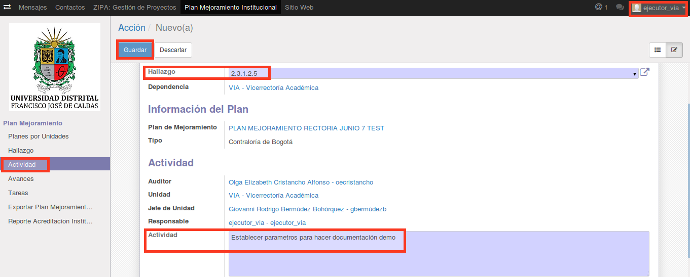

A continuación los campos de la Actividad.

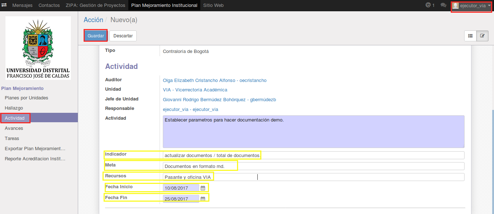

Cuando se Crea o se Actualiza una actividad, en el menú de **Historia de comunicación** se reportan la información mas relevante de esta.

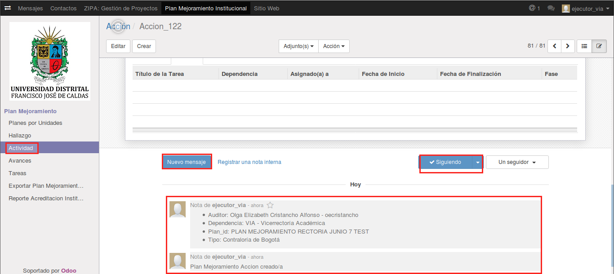

### Crear Avances Desde el Módulo Actividades:

Una vez seleccionado la Actividad a la que se le adicionará Avances, click en editar.

Nota: el usuario **Ejecutor** solo podrá realizar un Avances por mes y esto en las fechas establecidas por el usuario **Administrador o Auditor**.

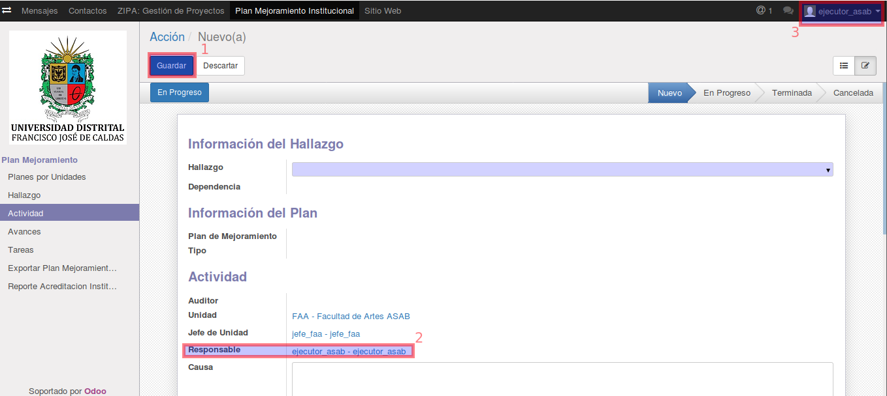

1. boton Editar
2. Usuarios **Ejecutor** asignado a la acción.
3. Usuario con el que está logueado.

Se habilitará la sección de Avances. Click en **Adicionar un elemento**

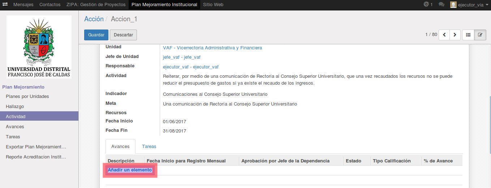

Se desplegará el formulario de Avances. Diligenciar.

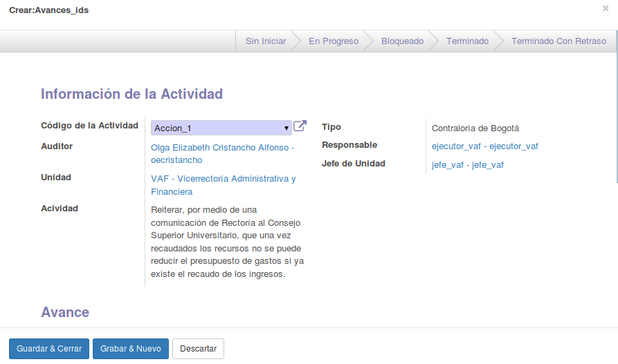

Click en **guardar y cerrar** de la ventana de Avances, click en **guardar** de la ventana de acción.

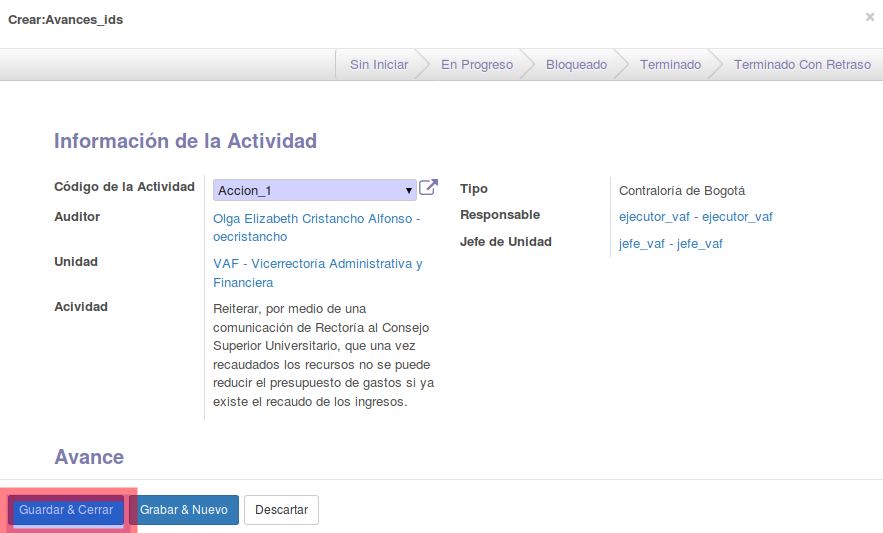

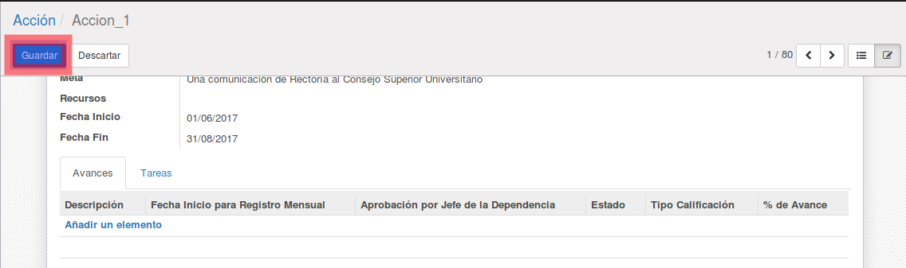

## Avances

Otra de las funcione primordiales de usuario **Ejecutor** es el registro de los Avances, que desarrollará la unidad para soportar mensualmente el trabajo realizado para cumplir con la Actividad definida.

### Crear Avances

Click en el menú del Avances y luego click en el botón **Crear**.

Nota: el usuario **Ejecutor** solo podrá realizar un Avances por mes y esto en las fechas establecidas por el usuario **Administrador o Auditor**.

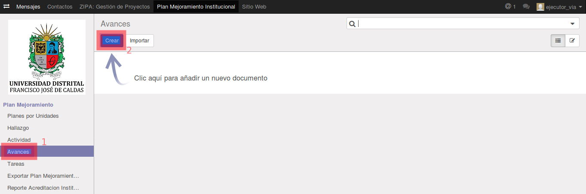

El campo **Código Actividad**, nos listará las Actividades que se encuentran en estado **En Progreso**

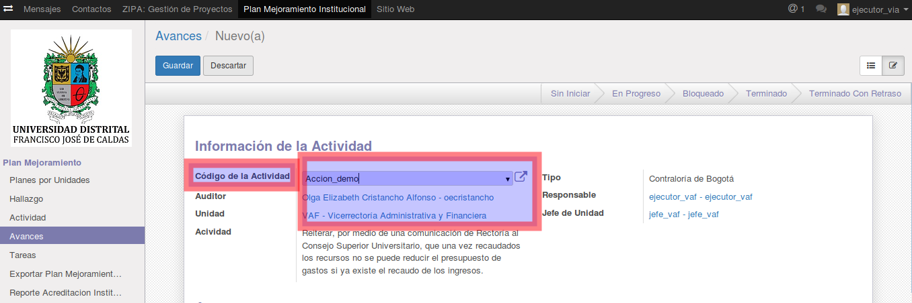

En la siguiente imagen mostramos todas las Actividades registradas, resaltando su estado.

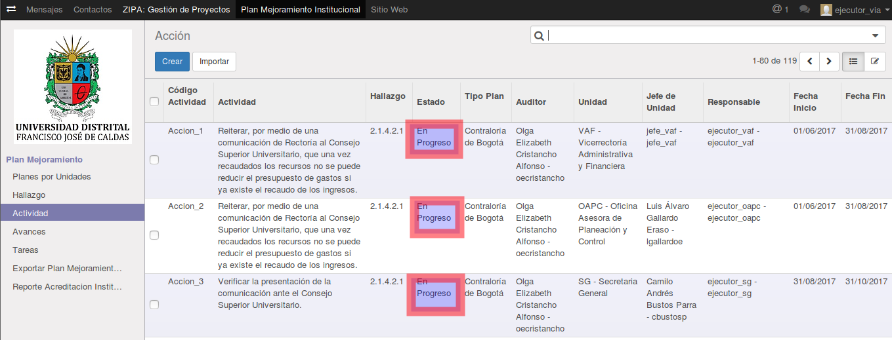

En la siguiente imagen se finaliza la operación de creación de **Avances**. como podemos ver se reporta la operación en el menú de **Historia de Comunicación**

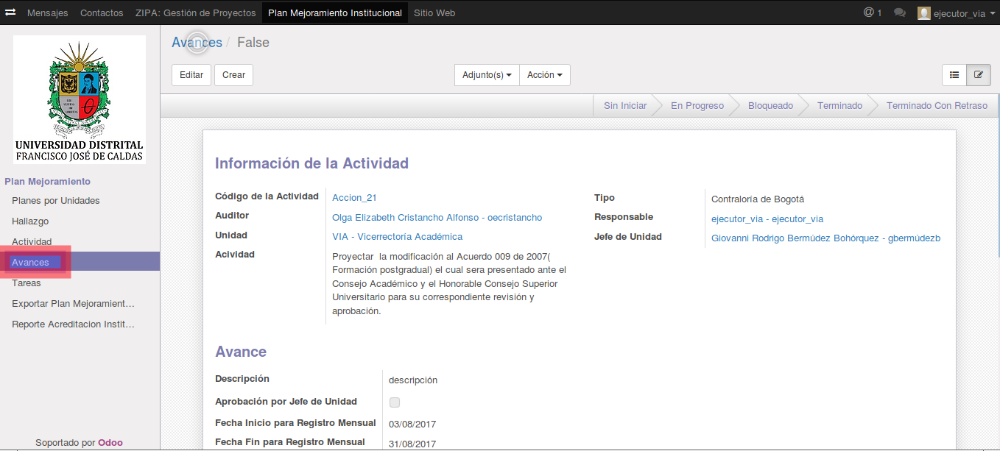

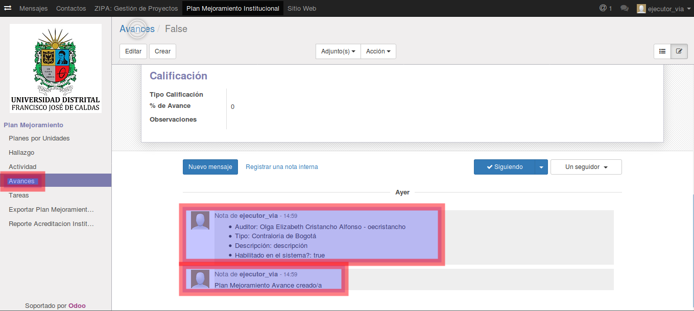
