[[
title: Documento de diseño de Alto Nivel del Proceso Registro y Seguimiento Planes de Mejoramiento
author: José Javier Vargas Serrato
]]
Sistema de Seguimiento y Control a los Planes de Mejoramiento (SCPM)
===================================================================

Manual de usuario Ejecutor
============================

[TOC]

Introducción
--------------------------------
En esta sección abordaremos las distintas funcionalidades del usuario Ejecutor en el módulo de planes de mejoramiento del sistema Odoo.

## Planes por Área
En esta apartado el usuario Ejecutor podrá ver todos los planes que correspondan a su área. Esto quiere decir que existirán muchos más planes que pertenecerán a otras áreas de la entidad, pero el usuario solo podrá ver los de su área.

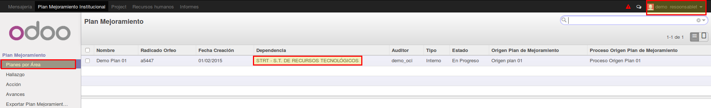

Si damos click sobre alguno de los registro de planes que aparecen en el listado podremos acceder a la información de este.

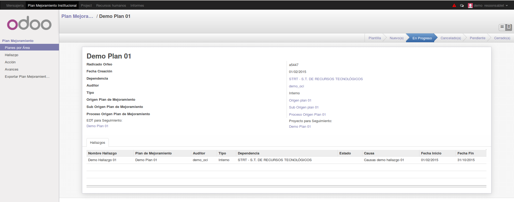

## Hallazgo
En esta sección el Ejecutor podrá ver todos los **Hallazgos** que correspondan a su área.

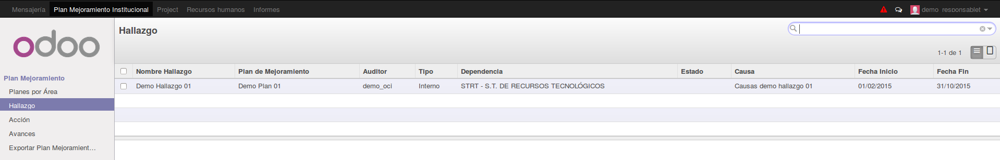

## Acciones
En esta sección abordaremos las funciones específicas del usuario **Ejecutor** con respecto a las acciones.

#### Crear Avances Desde el Módulo Acción:

Una vez seleccionado la acción a la cual puede adicionarle avances, click en editar.

Nota: el usuario **Ejecutor** solo podrá realizar un avances por mes y esto en las fechas establecidas por el usuario **Administrador**.

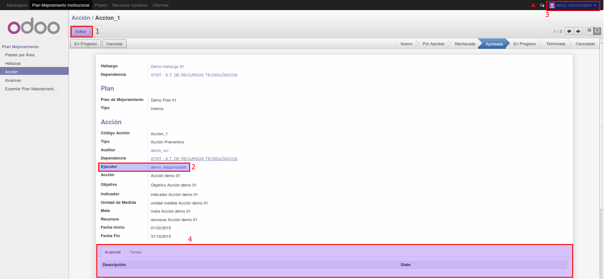

1. boton Editar
2. Usuarios **Ejecutor** asignado a la acción.
3. Usuario con el que está logueado.
4. Sección de avances no habilitada.

Se habilitará la sección de avances. Click en **Adicionar un elemento**

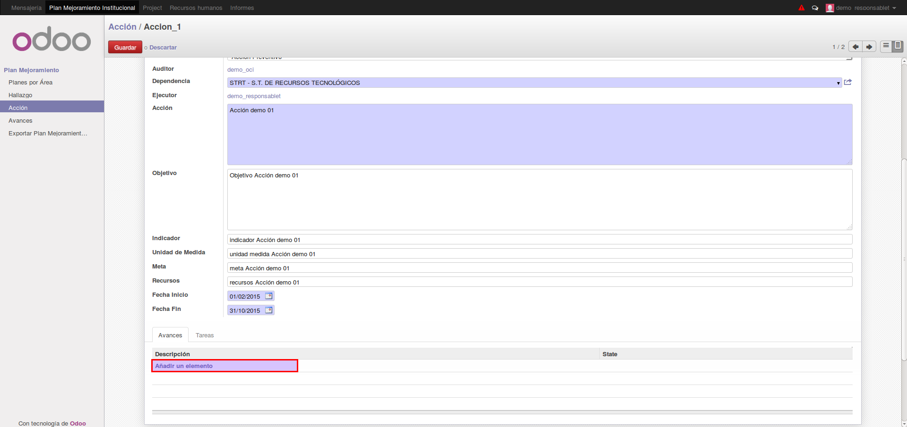

Se desplegará el formulario de Avances. Diligenciar.

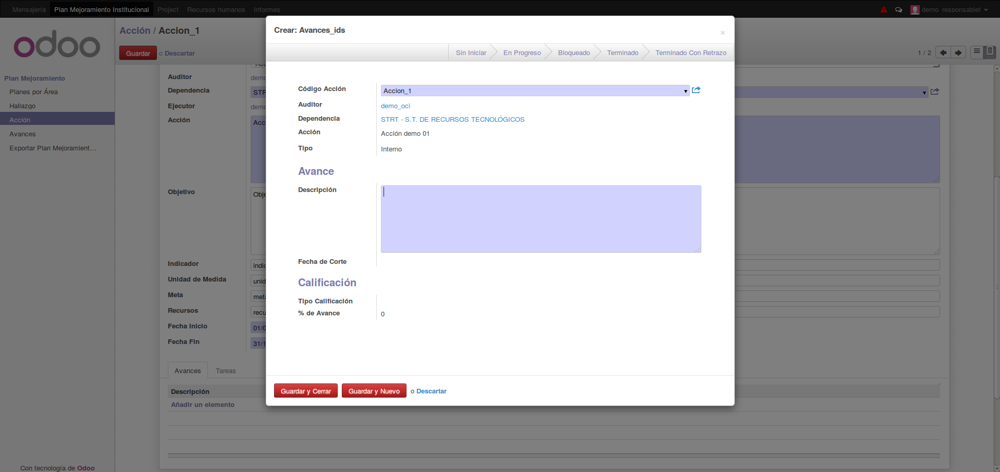

Click en **guardar y cerrar** de la ventana de avances, click en **guardar** de la ventana de acción.

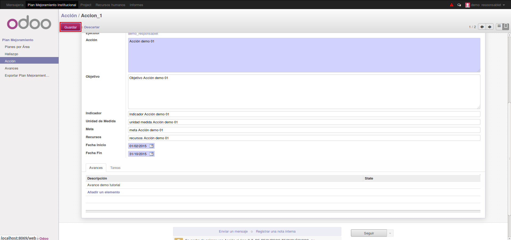

## Avances
Click en el menú del avances y luego click en el botón **Crear**.

Nota: el usuario **Ejecutor** solo podrá realizar un avances por mes y esto en las fechas establecidas por el usuario **Administrador**.

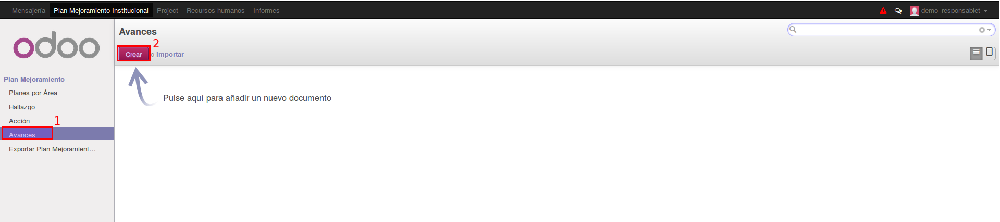

El campo **Código Acción** nos listará las acciones que se encuentran en estado **En Progreso**

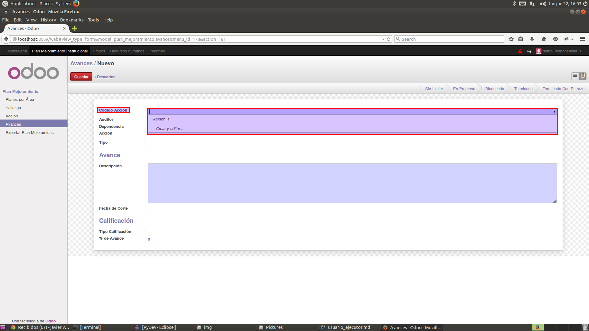

En la siguiente imagen mostramos todas las Acciones registradas, resaltando su estado.

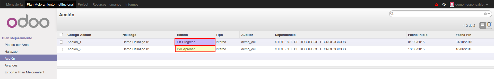

En la siguiente imagen se finaliza la operación de creación de **Avances**. como podemos ver se reporta la operación en el menú de **Historia de Comunicación**

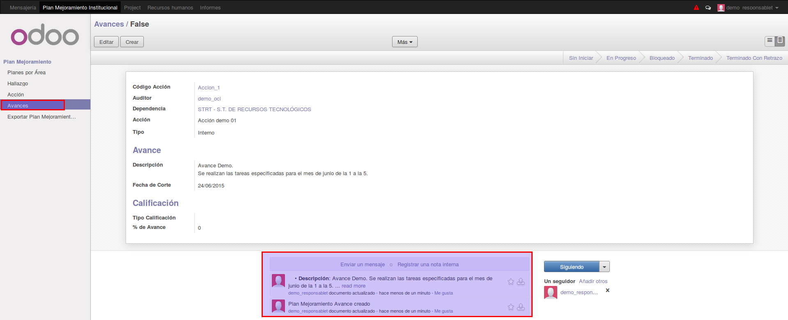