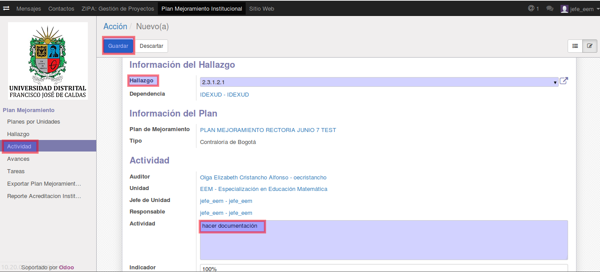
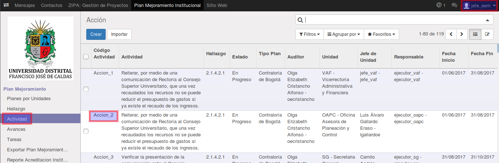
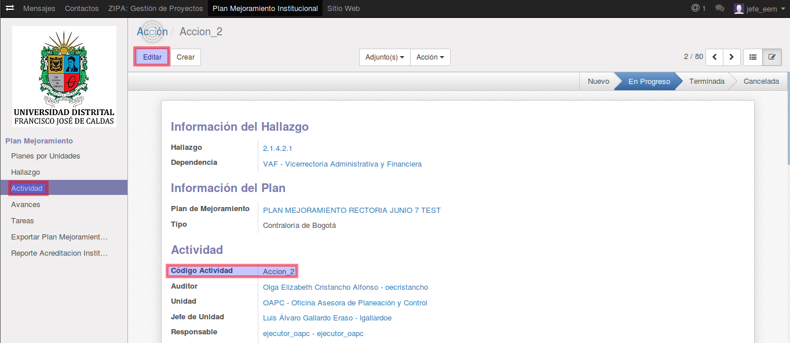
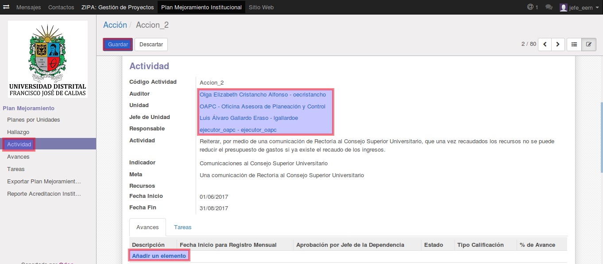
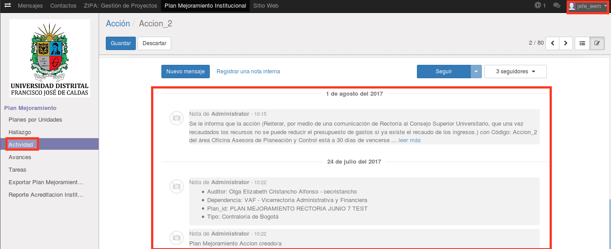

[[
title: Documento de diseño de Alto Nivel del Proceso Registro y Seguimiento Planes de Mejoramiento
author: José Javier Vargas Serrato
]]
SÍSIFO: Sistema de Seguimiento y Control a los Planes de Mejoramiento
===================================================================

Manual de usuario Jefe Dependencia
============================

[TOC]

Introducción
--------------------------------
En esta sección abordaremos las distintas funcionalidades del usuario Jefe Dependencia en el módulo de planes de mejoramiento del sistema Odoo.

## Planes por Área
En esta apartado el usuario jefe dependencia podrá ver todos los planes que correspondan a su área. Esto quiere decir que existirán muchos más planes que pertenecerán a otras áreas de la entidad, pero el usuario solo podrá ver los de su área.

En la siguiente imagen tendremos la vista de la sección **Planes por Área** de  un usuario **jefe dependencia** que pertenece al área de STRT.

1. El menú **Planes por Área**

2. Usuario jefe dependencia que pertenece al área de STRT

En la siguiente imagen tendremos la misma vista de la sección **Planes por Área** pero del usuario **OCI**, este si tendra acceso a todos los planes.

Vemos claramente que existen 2 planes pero que uno pertenece al área de STRT y el otro al área de DG. En el caso el jefe dependencia sólo verá los planes de su incumbencia; los que pertenecen a su área.

## Hallazgo
 En esta sección el usuario jefe dependencia podrá ver todos los **Hallazgos** que correspondan a su área.
 

## Actividades
En esta sección abordaremos las funciones específicas del usuario jefe dependencia con respecto a las actividades.

#### Crear, Cancelar o Editar las Actividades
Los usuarios jefe y ejecutor tienen los permisos para crear  una **actividad** y la  pueden cambiar de estado **Sin Iniciar, en Progreso, Bloqueado, Terminado, Terminado Con Retraso** luego de crearla.

**Crear la actividad**

Para crear una nueva actividad

	1. Click en el módulo de Actividad

	2. Click en la opcion Crear

Tenemos la opción de asignar nombre al hallazgo, la causa, la actividad a efectuar, el objetivo el indicador, la Unidad de Medida, la Meta, los Recursos y las fechas de inicio y fin. Por defecto la actividad se va a asociar a un hallazgo ya creado o podemos crear el hallazgo, el cual, quedara asignado a la dependencia del jefe que este creando la actividad.

**Editar la actividad**

Para editar una actividad

	1. Click en el módulo de Actividad

	2. Click en la actividad a Editar
	

Luego de dar clic en la opcion de Editar el jefe puede hacer un seguimiento a la actividad, a la cual si lo dispone le puede agregar un avance mediante la opcion "Añadir un elemento".

Al añadir un avance se debe asignar un ejecutor y el auditor que hara seguimiento a la actividad, luego de editar estos campos damos clic en "Guardar y Cerrar" para cambiar de actividad o "Guardar y Nuevo" en caso de querer seguir creando avances o "Descartar" si no se quiere crear el avance.

Los cambios se reportan a manera de comentarios en la parte final de la interfaz de edición de la actividad, en la que es posible añadir un comentario sobre la actividad y tambien se puede seguir la actividad para recibir notificaciones sobre los cambios efectuados en la actividad.

## Avances

En esta sección abordaremos las funciones específicas del usuario jefe dependencia con respecto a los avances.

**Crear el avance**

Para crear un nuevo avance

	1. Click en el módulo de Avances

	2. Click en la opcion Crear

Ene esta parte el jefe puede añadir una descripción y dar aprobación al avance.

**Editar el avance**

El usuario **jefe dependencia** al igual que el usuario **Ejecutor** podrá hacer algunas ediciones en los avances siempre y cuando este no se haya calificado. una vez calificado no se podrá editar el avances.

Una vez seleccionada el avance, click en **Editar**.

Se habilitarán los campos modificables, donde se destaca que el jefe en este caso tiene la facultad para aprobar la avance, dando el visto bueno en la casilla "Aprobación por Jefe de Unidad".

Los cambios se reportan en el menú **Historia de Comunicación**, donde se pueden añadir comentarios y con la opción "Seguir" es posible que el jefe reciba notificaciones del progreso que se haga del avance.

