[[
title: Documento de diseño de Alto Nivel del Proceso Registro y Seguimiento Planes de Mejoramiento
author: José Javier Vargas Serrato
]]
SÍSIFO: Sistema de Seguimiento y Control a los Planes de Mejoramiento
===================================================================

Manual de usuario Jefe Dependencia
============================

[TOC]

Introducción
--------------------------------
En esta sección abordaremos las distintas funcionalidades del usuario Jefe Dependencia en el módulo de planes de mejoramiento del sistema SÍSIFO.

## Planes por Unidades

En esta apartado el usuario jefe dependencia podrá ver todos los planes de mejoramiento de las distintas unidades.

En la siguiente imagen tendremos la vista de la sección **Planes por Área** de  un usuario **jefe dependencia** que pertenece al área de EEM (Especialización en Educación Matemática).

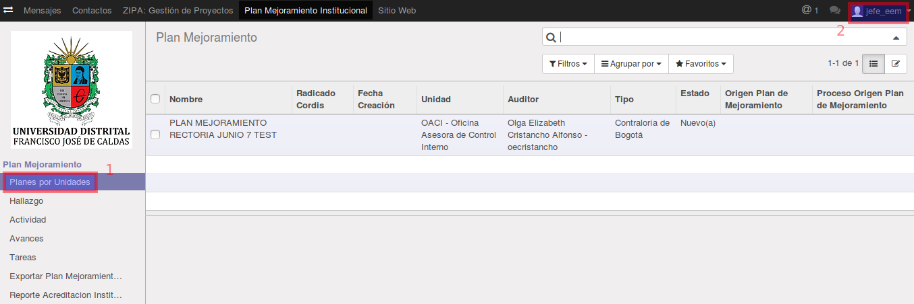

1. El menú **Planes por Área**

2. Usuario jefe dependencia que pertenece al área de EEM (Especialización en Educación Matemática)

## Hallazgo

 En esta sección el usuario jefe dependencia podrá ver todos los **Hallazgos** que existan de su unidad y demas unidades. Podrá hacer uso de los filtros y agrupaciones para solo ver los que le interesa.

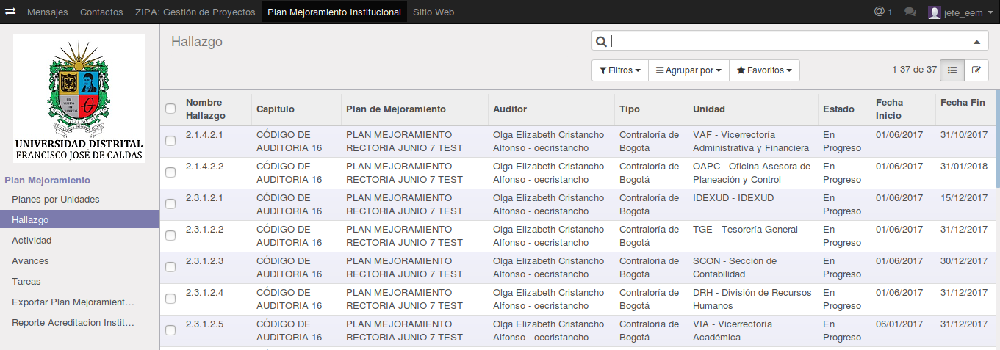

## Actividades
En este apartado el usuario Jefe Dependencia podrá Crear, Editar Actividades y Crear Avances desde la opcion de edición de la Actividad.

### Crear Actividades

Para crear una nueva actividad

1. Click en el módulo de Actividad

2. Click en la opcion Crear

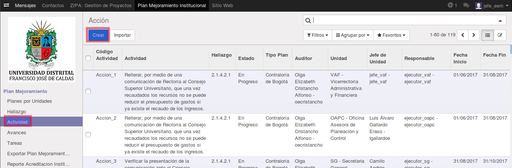

En cada uno de los formularios de los distintos objetos del sistema, los campos resaltados de color morado claro indican que son obligatorios.

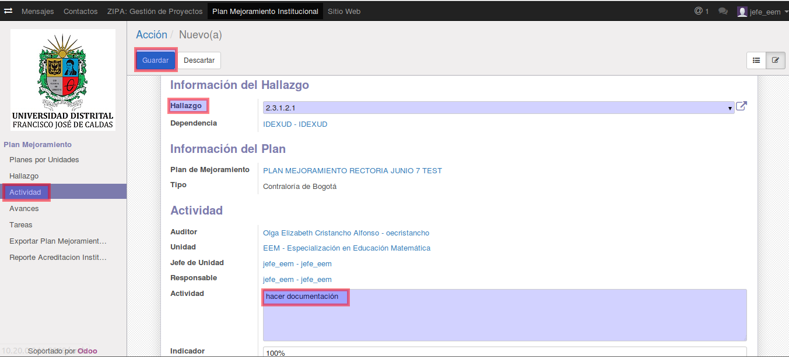

### Editar la actividad

Para editar una actividad

1. Click en el módulo de Actividad

2. Click en la actividad a Editar

3. Click en Editar.
	
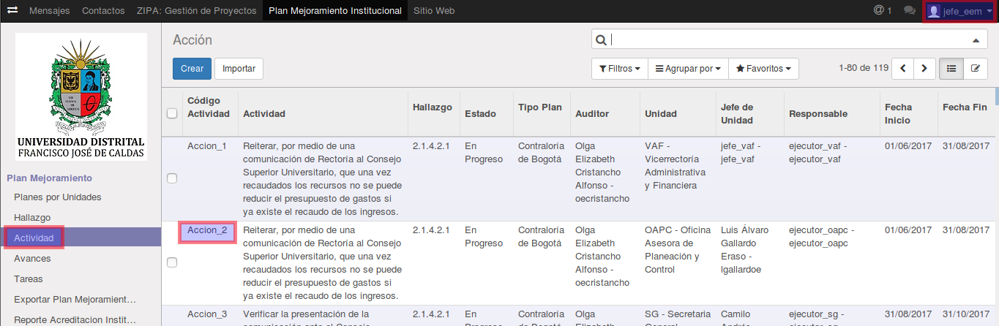

La Actividad se podrá editar siempre y cuando el estado este en **nuevo**. una vez cambia a estado **En Progreso** no se podra cambiar información de los campos.

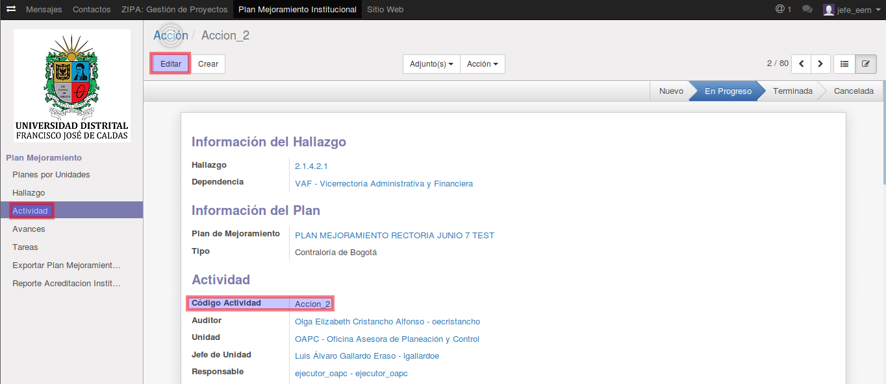

Cuando se **Crea** o se **Actualiza** una actividad, en el menú de **Historia de comunicación** se reportan la información mas relevante de esta.

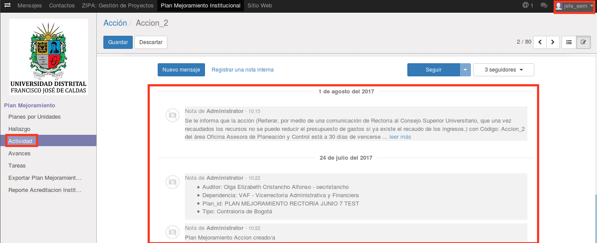

### Crear Avances Desde el Módulo Actividades:

Cuando estamos editando una actividad tenemos la opción de agregar un avances a esta actividad. Simplemente nos diriguimos a la pestaña de avances y clic en **Añadir un elemento**

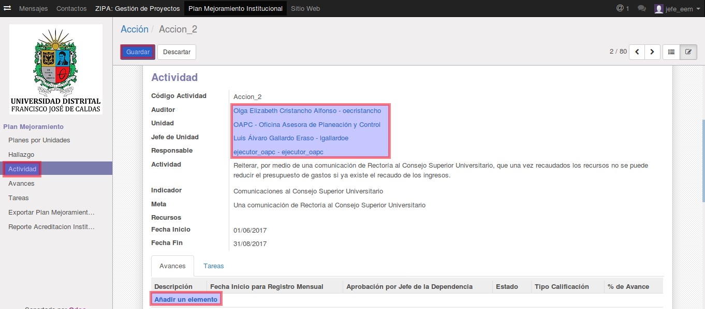

El sistema nos proporcionará el formulario de avances, este cuenta con una sección en la parte superior con la información relacionada de la actividad y en la parte inferior la sección del avance donde diligenciaremos la información de este.

## Avances

En esta sección el usuario jefe dependencia podrá crear y editar avances.

**Crear Avance**

Para crear un nuevo avance

1. Click en el módulo de Avances

2. Click en la opcion Crear

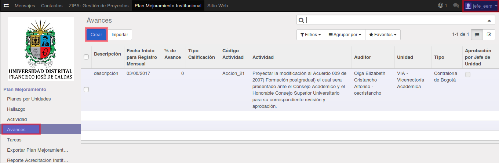

El jefe dependencia deberá seleccionar la Actividad a la cual quiere asociarle el avance, diligenciará los campos  de **descripción** y **Aprobación por Jefe de Unidad **.

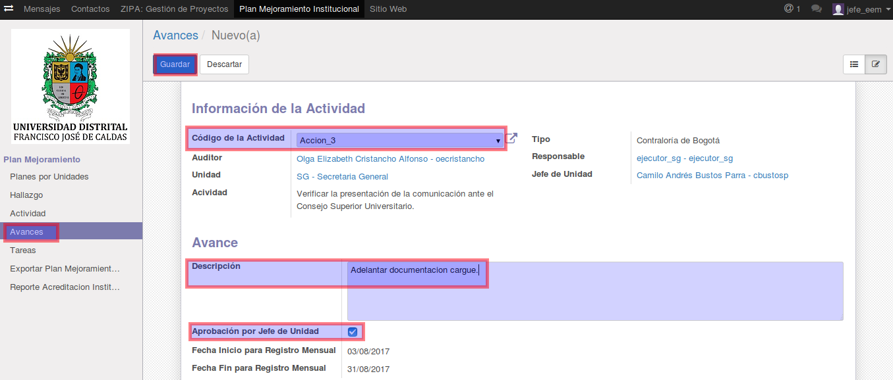

**Editar el avance**

Cuando el avance a sido creado por el usuario **Ejecutor**, este avance solo podra ser calificado por el usuario **Auditor** una vez se halla realizado la aprobación del usuario **Jefe Dependencia** de esta unidad. dando por entender en el sistema que el jefe esta consiente y enterado de la realización de las actividades por sus usuarios ejecutores asignados.

Seleccione el Avance, click en **Editar**.

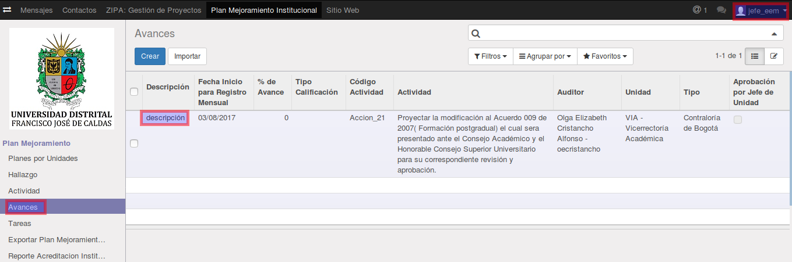

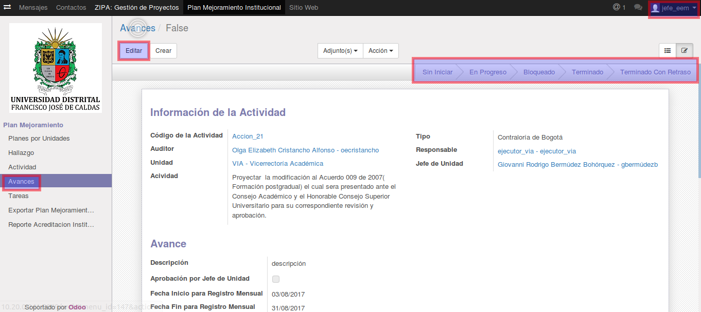

Se habilitarán los campos editables y obligatorios.

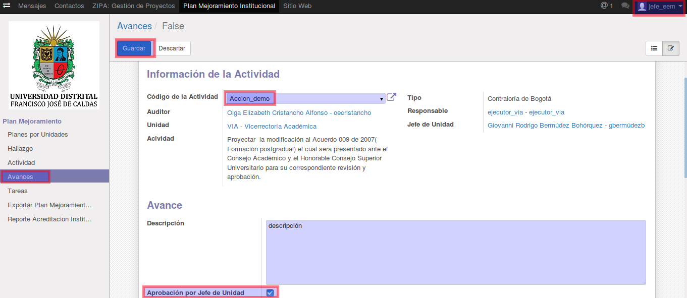

El formulario de avances tambien cuenta con la seccion de **Historia de Comunicación**, donde cada vez que se crea o se actuliza el avance, esta información es creada automaticamente. Tambien se pueden añadir comentarios y con la opción "Seguir" es posible que el jefe reciba al correo cada una de estas notificaciones.

