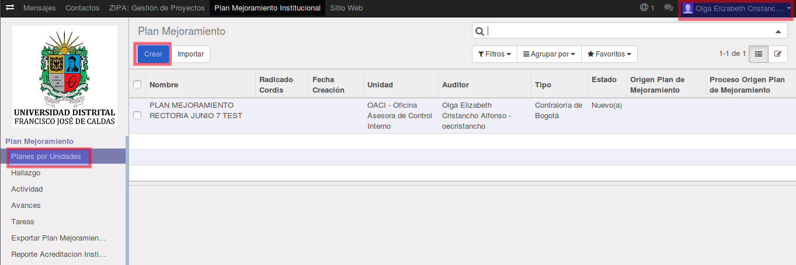
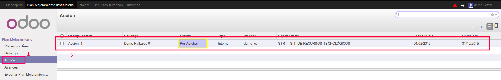
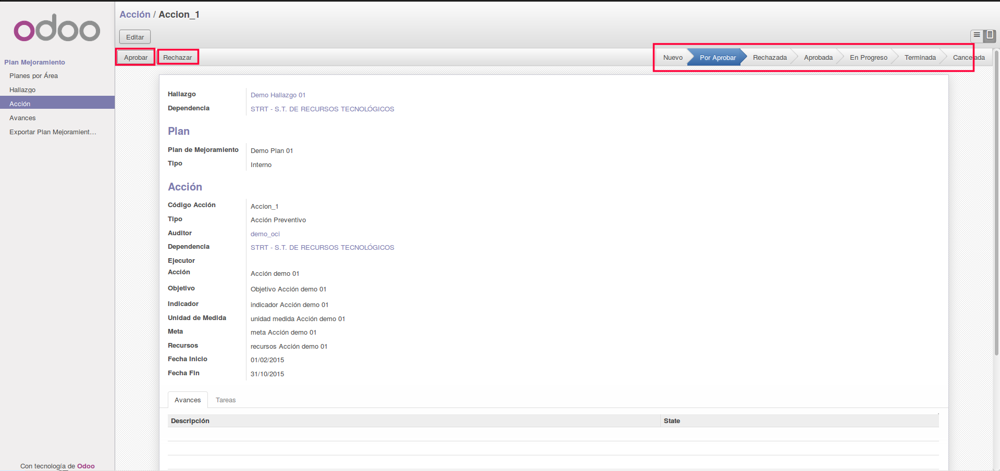
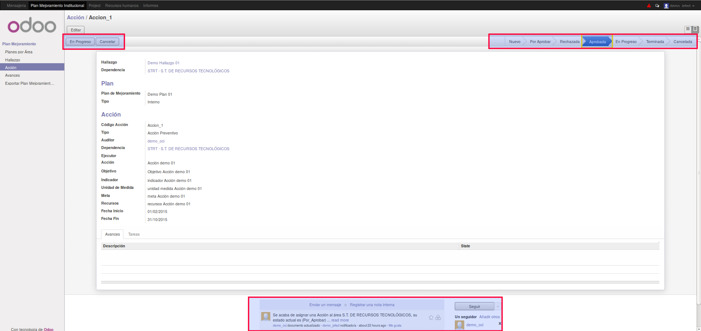
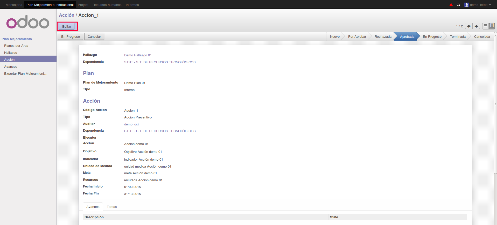
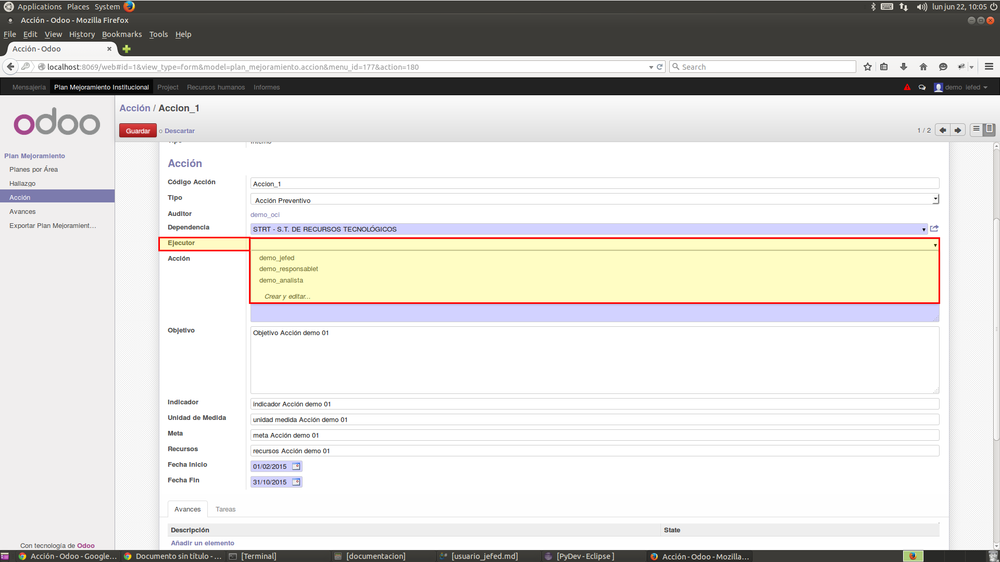
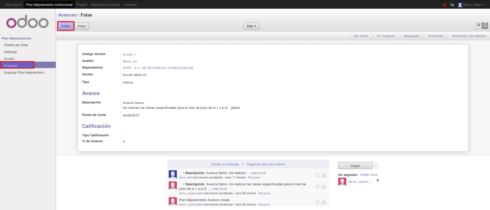
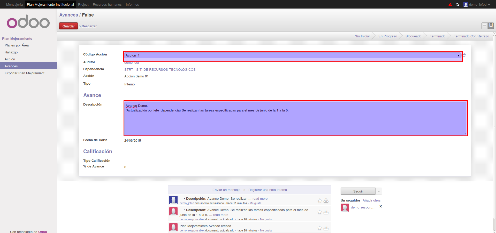
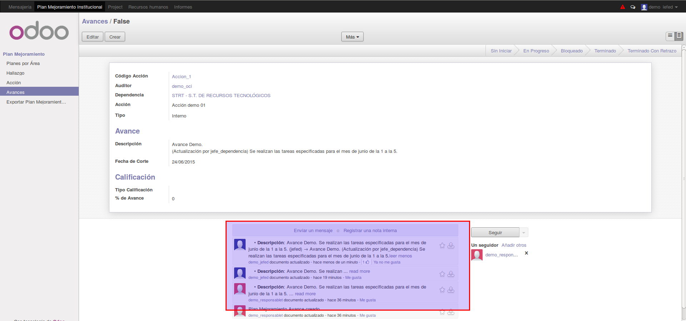

[[
title: Documento de diseño de Alto Nivel del Proceso Registro y Seguimiento Planes de Mejoramiento
author: José Javier Vargas Serrato
]]
SÍSIFO: Sistema de Seguimiento y Control a los Planes de Mejoramiento
===================================================================

Manual de usuario Jefe Dependencia
============================

[TOC]

Introducción
--------------------------------
En esta sección abordaremos las distintas funcionalidades del usuario Jefe Dependencia en el módulo de planes de mejoramiento del sistema Odoo.

## Planes por Área
En esta apartado el usuario jefe dependencia podrá ver todos los planes que correspondan a su área. Esto quiere decir que existirán muchos más planes que pertenecerán a otras áreas de la entidad, pero el usuario solo podrá ver los de su área.

En la siguiente imagen tendremos la vista de la sección **Planes por Área** de  un usuario **jefe dependencia** que pertenece al área de STRT.

1. El menú **Planes por Área**

2. Usuario jefe dependencia que pertenece al área de STRT

En la siguiente imagen tendremos la misma vista de la sección **Planes por Área** pero del usuario **OCI**, este si tendra acceso a todos los planes.

Vemos claramente que existen 2 planes pero que uno pertenece al área de STRT y el otro al área de DG. En el caso el jefe dependencia sólo verá los planes de su incumbencia; los que pertenecen a su área.

## Hallazgo
 En esta sección el usuario jefe dependencia podrá ver todos los **Hallazgos** que correspondan a su área.

## Actividades
En esta sección abordaremos las funciones específicas del usuario jefe dependencia con respecto a las acciones.

#### Crear, Cancelar o Editar las Actividades
Los usuarios jefe y ejecutor tienen los permisos para crear  una **actividad** y la  pueden poner en el estado **en Progreso** luego de crearla.

- **Elegir la actividad**

	1. Click en el módulo de Actividad

	2. Click en la actividad Editar

- **Cambiar el estado Para Aceptar o Rechazar**

	En la parte superior izquierda se encontrará dos botones uno que dice **Aprobar** y el otro dice **Rechazar** para realizar la tarea de aceptación o rechazo por parte del jefe dependencia.
	

	1. **Aprobar**

        Al dar click en el botón **Aprobar** el estado de la actividad cambiará a **Aprobada**, cambiarán los botones y las actividades de estos; aparecerán los botones **En Progreso** y **Cancelar**, también se notificará en el menú de **Historia de Comunicación** el cambio de estado.

        
		Es importante Saber que solo se podrá adicionar avances a la **actividad** en el estado **En Progreso**. Por eso una vez el usuario **jefe dependencia** ha aceptado la Acción, si desea que dicha actividad sea intervenida por el usuario **Ejecutor** del área y este adicione avances, debe estar en el estado **En Progreso**

        En caso de dar click en el botón  **Cancelar**.  El estado de la acción cambiará a **cancelada**. la actividad estará disponible para lectura, pero no se podrá adicionar avances a esta.

	2. **Rechazar**

		Al dar click en el botón **Rechazar**  el estado de la activiadad cambiará a **Rechazada** inmediatamente el sistema notificará al usuario **OCI** por medio de un correo electrónico, en el menú de **Mensajería** como en el menú de **Historia de Comunicación** del rechazo de dicha actividad.

		En este Caso el Usuario **OCI** revisará la actividad si tiene errores o fue asignada a un área que no le correspondía, luego de esto la actividad volverá a ser asignada cambiando el estado de esta a **Por Aprobar**.

#### Asignar Ejecutor a las Actividades
El usuario **jefe dependencia** debe asignar para cada una de las actividades a un usuario **ejecutor** de su área, este realizará los avances mensuales. Para ello estando en la actividad, damos click en editar y luego en el campo **Ejecutor**, este nos mostrará los usuarios existente del área.

## Avances
El usuario **jefe dependencia** al igual que el usuario **Ejecutor** podrá hacer algunas ediciones en los avances siempre y cuando este no se haya calificado. una vez calificado no se podrá editar el avances.

Una vez seleccionada el avance, click en **Editar**.

Se habilitarán los campos modificables

Los cambios se reportan en el menú **Historia de Comunicación**

