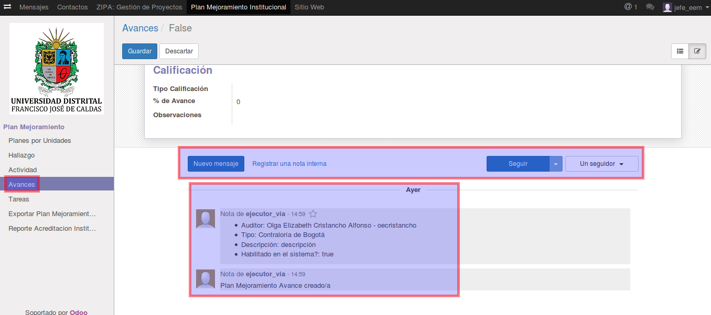

[[
title: Documento de diseño de Alto Nivel del Proceso Registro y Seguimiento Planes de Mejoramiento
author: José Javier Vargas Serrato
]]
SÍSIFO: Sistema de Seguimiento y Control a los Planes de Mejoramiento
===================================================================

Manual de usuario Jefe Dependencia
============================

[TOC]

Introducción
--------------------------------
En esta sección abordaremos las distintas funcionalidades del usuario Jefe Dependencia en el módulo de planes de mejoramiento del sistema SÍSIFO.

## Planes por Unidades
En esta apartado el usuario jefe dependencia podrá ver todos los planes de mejoramiento de las distintas unidades.

En la siguiente imagen tendremos la vista de la sección **Planes por Área** de  un usuario **jefe dependencia** que pertenece al área de EEM (Especialización en Educación Matemática).

1. El menú **Planes por Área**

2. Usuario jefe dependencia que pertenece al área de EEM (Especialización en Educación Matemática)

## Hallazgo
 En esta sección el usuario jefe dependencia podrá ver todos los **Hallazgos** que existan de su unidad y demas unidades. Podrá hacer uso de los filtros y agrupaciones para solo ver los que le intereza.

## Actividades
En esta sección abordaremos las funciones específicas del usuario jefe dependencia con respecto a las actividades.

### Crear, Cancelar o Editar las Actividades

Los usuarios **jefe ** y **ejecutor** tienen los permisos para crear una **actividad**.

### Crear la actividad

Para crear una nueva actividad

1. Click en el módulo de Actividad

2. Click en la opcion Crear

Los campos de color morado son obligatorios.

**Editar la actividad**

Para editar una actividad

1. Click en el módulo de Actividad

2. Click en la actividad a Editar

3. Click en Editar.
	

La Actividad se podrá editar siempre y cuando el estado de esta este en **nuevo**. una vez cambia a estado **En Progreso** no se podra cambiar información de los campos.

Al añadir un avance se debe asignar un ejecutor y el auditor que hara seguimiento a la actividad, luego de editar estos campos damos clic en "Guardar y Cerrar" para cambiar de actividad o "Guardar y Nuevo" en caso de querer seguir creando avances o "Descartar" si no se quiere crear el avance.

Los cambios se reportan a manera de comentarios en la parte final de la interfaz de edición de la actividad, en la que es posible añadir un comentario sobre la actividad y tambien se puede seguir la actividad para recibir notificaciones sobre los cambios efectuados en la actividad.

## Avances

En esta sección abordaremos las funciones específicas del usuario jefe dependencia con respecto a los avances.

**Crear el avance**

Para crear un nuevo avance

	1. Click en el módulo de Avances

	2. Click en la opcion Crear

Ene esta parte el jefe puede añadir una descripción y dar aprobación al avance.

**Editar el avance**

El usuario **jefe dependencia** al igual que el usuario **Ejecutor** podrá hacer algunas ediciones en los avances siempre y cuando este no se haya calificado. una vez calificado no se podrá editar el avances.

Una vez seleccionada el avance, click en **Editar**.

Se habilitarán los campos modificables, donde se destaca que el jefe en este caso tiene la facultad para aprobar la avance, dando el visto bueno en la casilla "Aprobación por Jefe de Unidad".

Los cambios se reportan en el menú **Historia de Comunicación**, donde se pueden añadir comentarios y con la opción "Seguir" es posible que el jefe reciba notificaciones del progreso que se haga del avance.

