[[
title: Documento de diseño de Alto Nivel del Proceso Registro y Seguimiento Planes de Mejoramiento
author: José Javier Vargas Serrato
]]
Sistema de Seguimiento y Control a los Planes de Mejoramiento (SCPM)
===================================================================

Manual de usuario OCI
============================

[TOC]

Introducción
--------------------------------
En esta sección abordaremos las distintas funcionalidades del usuario OCI en el módulo de planes de mejoramiento del sistema Odoo.

Menú principal
----------------------------
Nuestro menú principal se encuentra en la parte superior de la interfaz de inicio del sistema Odoo definido como “Plan Mejoramiento Institucional” en este encontraremos todo lo correspondiente al seguimiento y control de los planes internos y externos “Contraloría de Bogotá y Contraloría General ”. Esto se ilustra en la siguiente imagen:
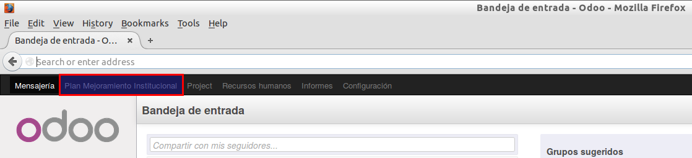

Una vez demos click en el menú principal aparecerá una sección en la parte izquierda que contendrá todos los objetos que intervienen en el proceso de control y seguimiento de los planes de mejoramiento "Hallazgo, Acción, Avances".  Ver la siguiente imagen.
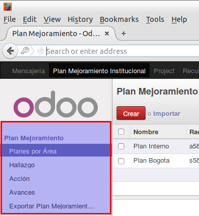
## Planes por Área
En esta apartado el usuario podrá crear y editar los planes ya sean internos o externos “Contraloría General, Contraloría General”.
Todos los usuarios OCI podrán ver los planes y demás objetos pertenecientes al plan (Hallazgos, Acciones) que hayan creado sus colegas OCI, pero solo podrá editar los de su pertenencia.

Cuando un usuario OCI crea un plan, el campo **Auditor** se alimenta automáticamente con el nombre del usuario que está haciendo la operación. Con esto se garantiza que sea de su pertenencia.

Para registrar un plan interno o externo, podrá seleccionar el campo **Tipó** y este proporciona las tres opciones a elegir.

**Nota 01:**
**Dependiendo la selección del campo ++tipo++ en el objeto plan; los objetos relacionados “Hallazgos, Acciones” y el mismo plan, solicitará más campos o menos, esto debido a las características de cada formato para dicho plan.**
#### Registrar Plan Interno
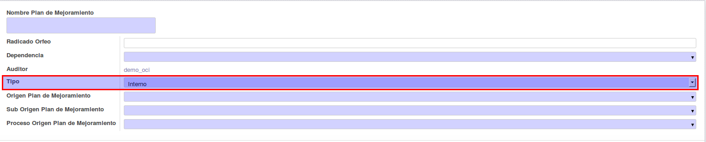

#### Registrar Plan Externo Contraloría Bogotá
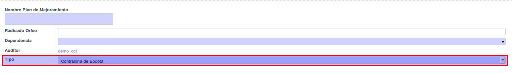

#### Registrar Plan Externo Contraloría General
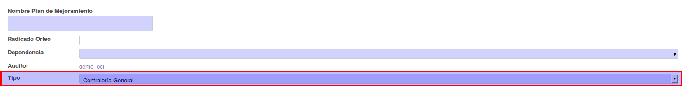

## Hallazgo
En esta sección el usuario podrá crear y editar hallazgos asociados o pertenecientes a un plan de mejoramiento. Esta operación podrá realizarse de dos manera:

#### Registrar Hallazgo Desde el Módulo Plan:
Una vez registrado el plan de mejoramiento o los planes, seleccionamos a cual de todos los existentes deseamos agregarle  hallazgos.
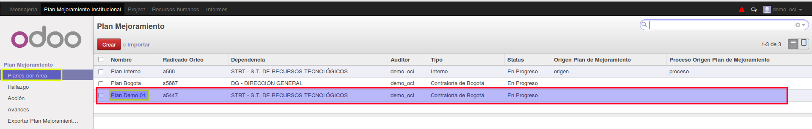

Click sobre este y luego en el botón Editar. Se nos habilitará la sección de hallazgos en la parte inferior.
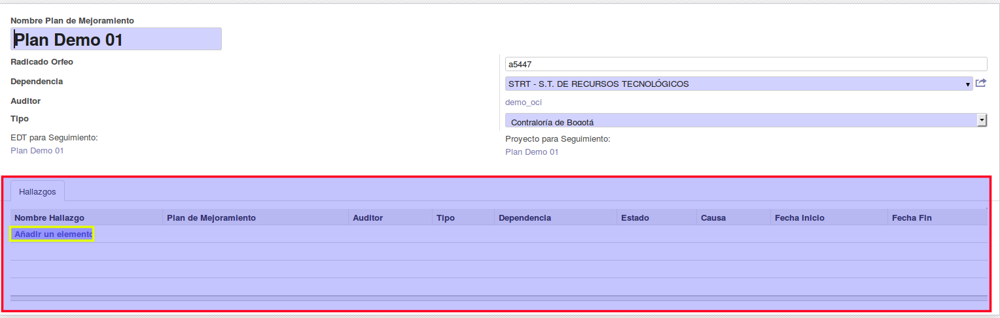

Una vez demos click sobre **Adicionar un elemento** el sistema nos proporcionará el formulario de registro para los hallazgos. Este formulario cuenta con una sección descriptiva del plan al cual va a pertenecer este hallazgo en la parte superior. En la parte inferior encontramos los campos correspondiente al hallazgo.
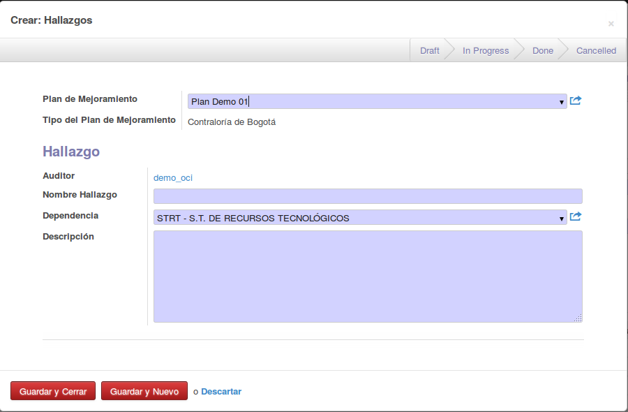

Para finalizar debe dar click en **Guardar y Cerrar** de la ventana de **Hallazgo **
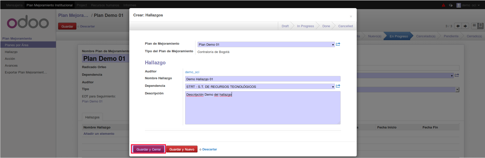

Luego Click en **Guardar** en la ventana del **Plan**
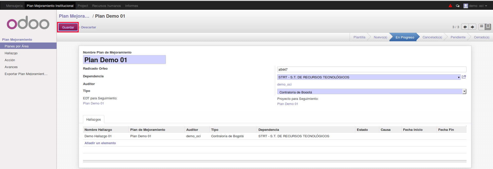

#### Registra Hallazgo:
La otra forma de registrar hallazgo es desde su menú. Simplemente damos click en el menú **Hallazgo** luego Click en **Crear**  como lo muestra la siguiente imagen.
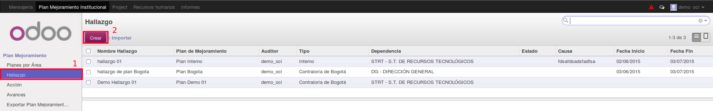

Después de esto el sistema nos mostrará el formulario de hallazgo para diligenciar. El campo **Plan Mejoramiento** nos permite elegir el plan al cual pertenecerá el hallazgo a crear.

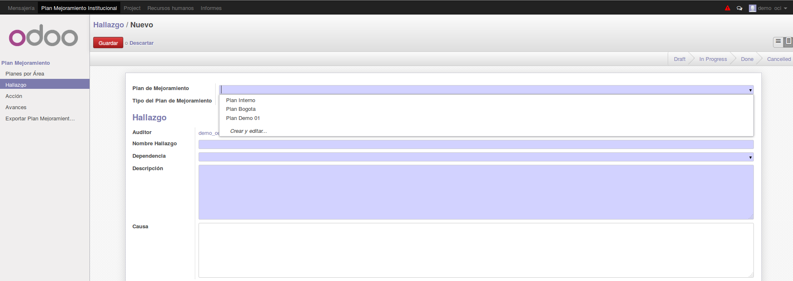

## Acciones
En esta sección el usuario podrá crear y editar Acciones asociados o pertenecientes a un Hallazgo. Esta operación podrá realizarse de dos manera; la primera es de manera similar a la definida en el apartado del hallazgo “Registrar Hallazgo Desde el Módulo Plan” Pero Con la diferencia de que usted se encontrará en el Módulo de Hallazgo y se asociará una o muchas **Acciones** a un **Hallazgo**,
La segunda forma es desde su menú principal.

#### Registrar Acciones Desde el Módulo Hallazgo:

Selecciona el hallazgo al cual desea agregarle la Acción, click sobre este.
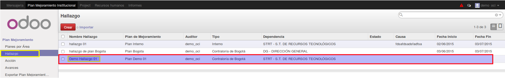
Click en editar.  Se nos habilitará la sección de Acción en la parte inferior.
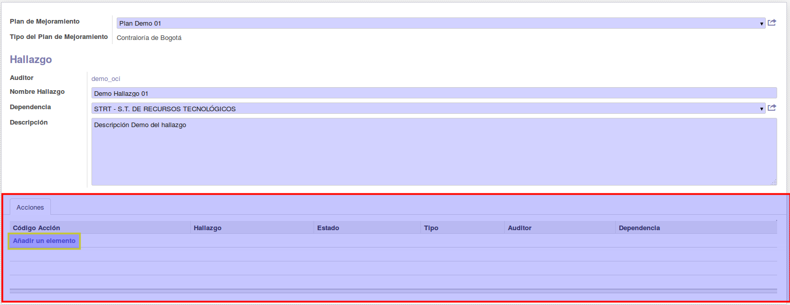
Click sobre **Adicionar un elemento** para que el sistema nos proporcionará el formulario de registro de Acciones.
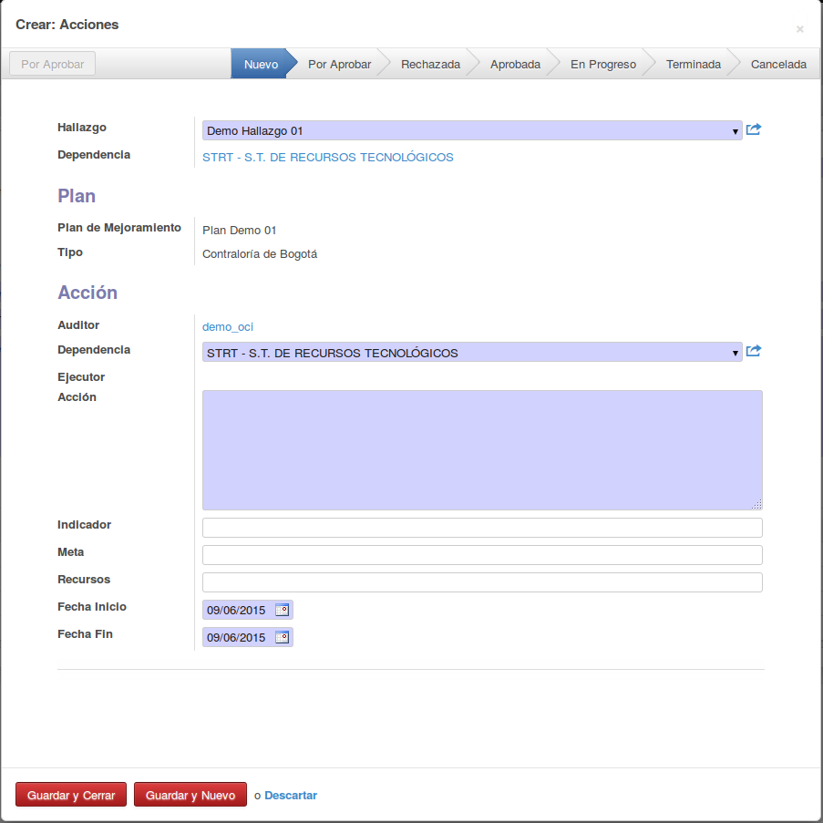
Para finalizar debe dar click en **Guardar y Cerrar** de la ventana de **Acciones**
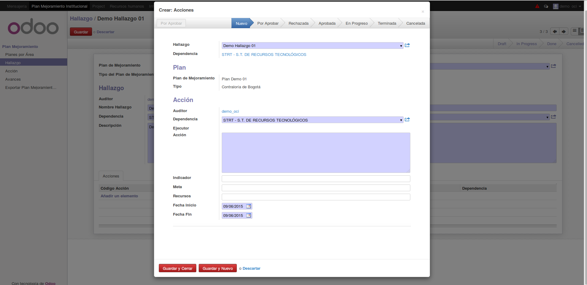
Luego Click en **Guardar** en la ventana del **Hallazgo**
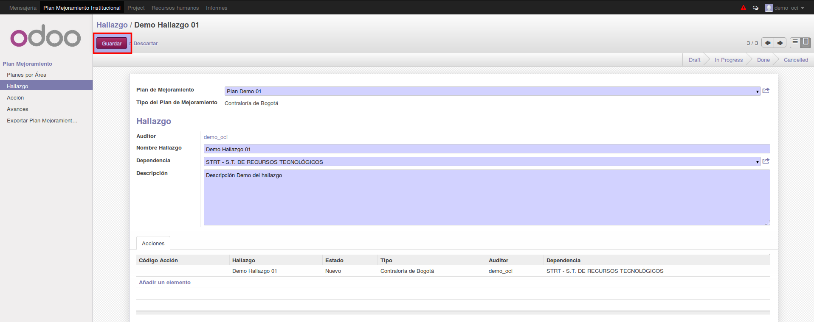

#### Registra Acciones:
La otra forma de registrar Acciones es desde su menú. Simplemente damos click en el menú **Acciones** luego Click en **Crear**  como no lo muestra la siguiente imagen.
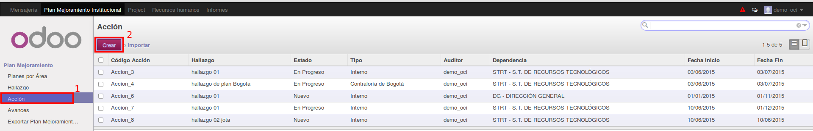
Después de esto el sistema nos mostrará el formulario de **Acción** para realizar el debido diligenciamiento.
El campo **Hallazgo** nos permite elegir el hallazgo al cual pertenecerá la acción a crear
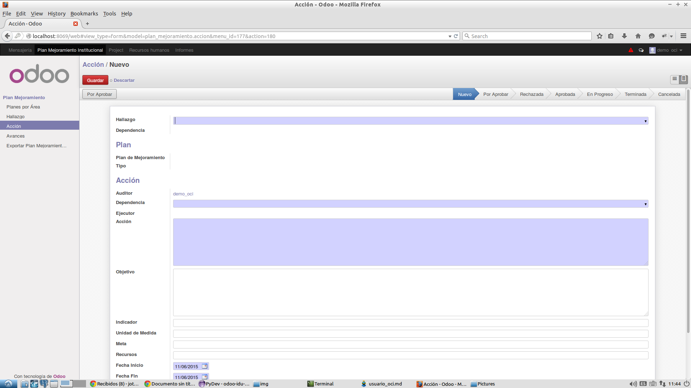

#### Asignar Acción
Luego de estar creada la acción, lo que se dispone hacer el usuario OCI es notificar esta acción al área correspondiente. Para esto en la parte superior se encontrará un botón llamado **Por Aprobar**, al dar click sobre este el estado de la acción pasará de **Nuevo** a **Por_Aprobar**, se le enviará un correo electrónico al Jefe de la dependencia que tenga asignada la Acción, y en el menú de **Mensaje** como de **Historia de Comunicación** se le notificará.

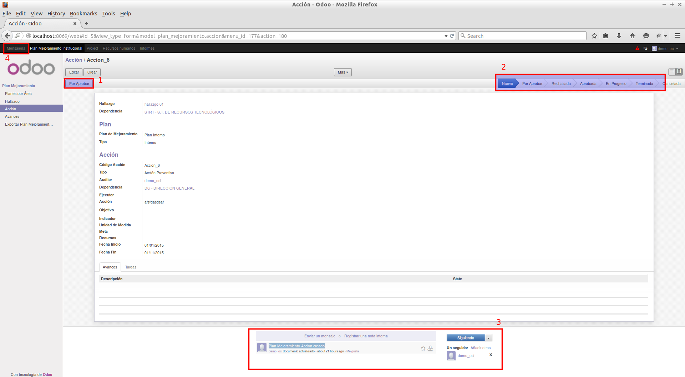

1. Botón para notificar la asignación de la acción.

2. Estados de las acciones

3. Menú Historia de Comunicación

4. Menú de mensajes

## Avances
#### Calificar Avances
 Una vez  creado el avance por el usuario **Responsable Tareas** El usuario **OCI** deberá calificarlo, Para esto deberá ingresar al módulo de Avances, seleccionar el avance que desea calificar y click sobre este. En la siguiente imagen se ilustra la manera de hacerlo.
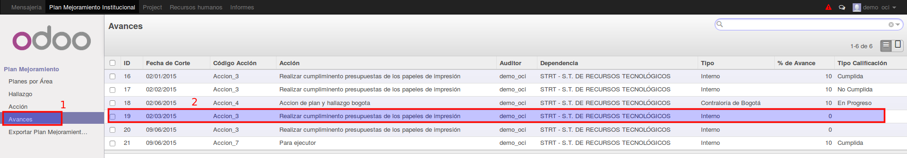

1. click en el módulo de avances

2. click en el registro de avances que se desea calificar

Luego de esto el sistema mostrará la información del avance. Si damos click en el botón **Editar** nos permitirá ingresar información en la sección de **Calificación** esto corresponde a los campos **Tipo Calificación** y **% de avance**. Luego de esto Click en Guardar y hemos realizado la calificación al avance.
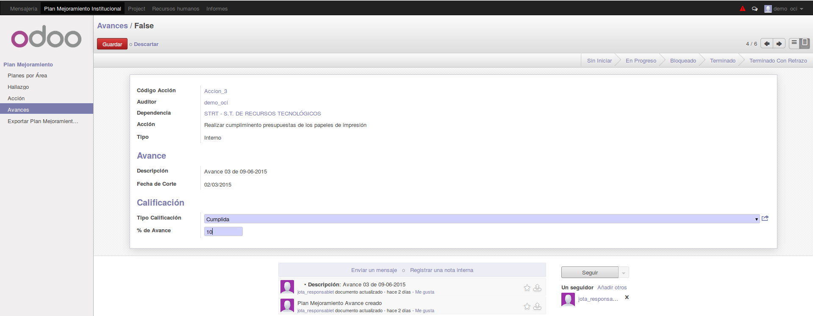

El sistema reportará la calificación en el menú **Historia de Comunicación** para que los usuarios que puedan ver los avances, puedan tener un historial de las calificaciones. De igual manera al usuario **responsable tareas** que haya creado el avance se el reportará la calificación en el menú de mensajes.
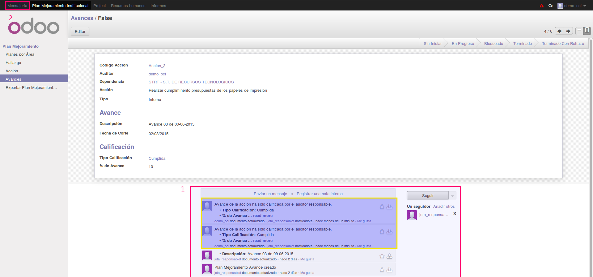

1. Menú Historia de Comunicación

2. Menú de mensajes
