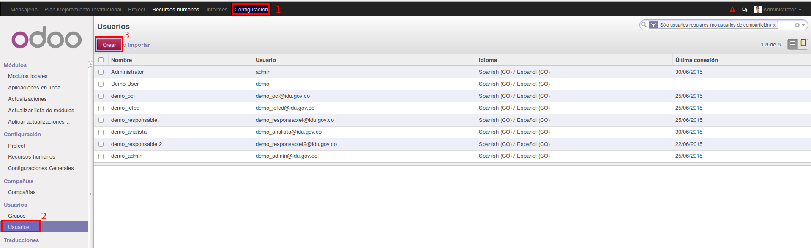
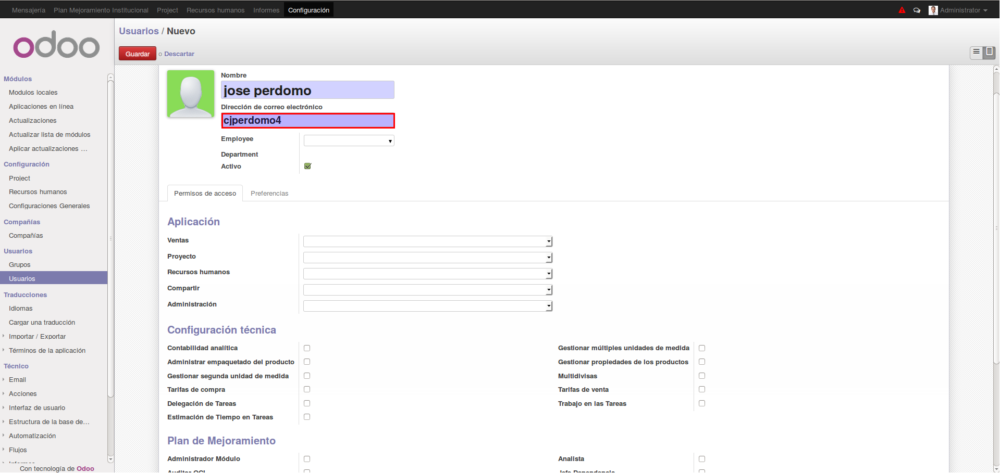
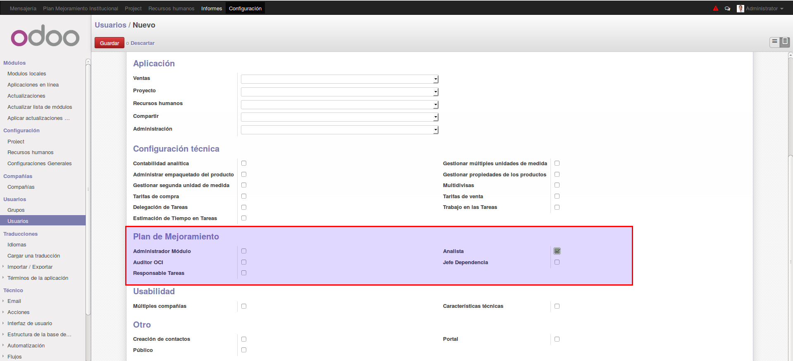
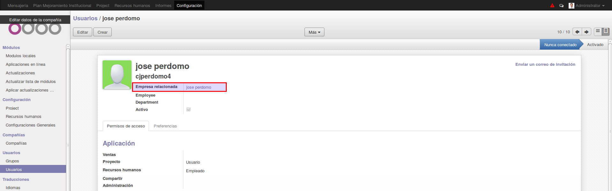
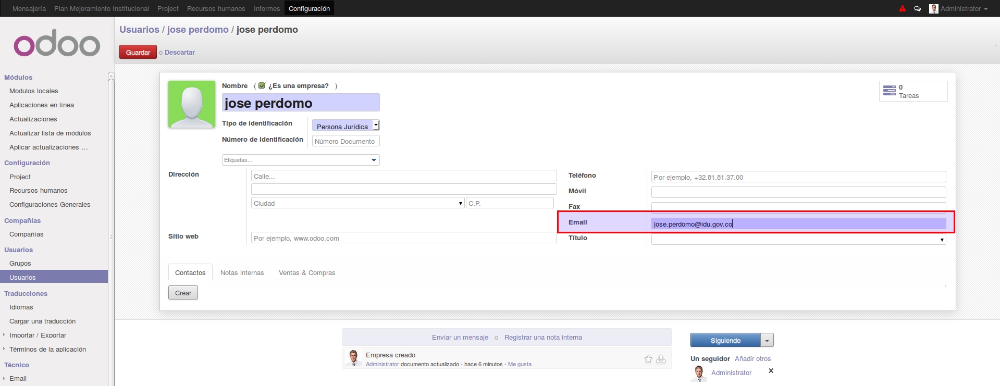
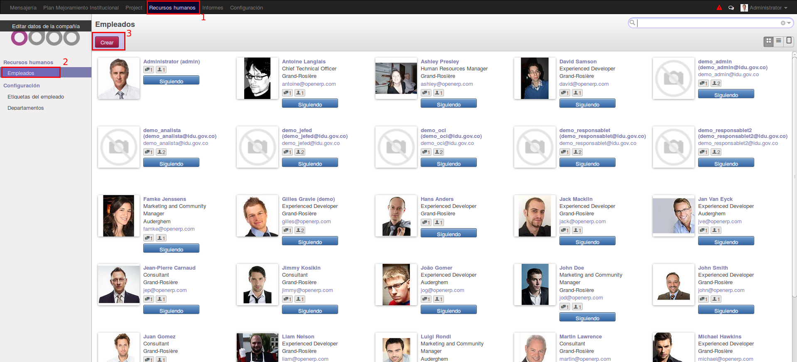
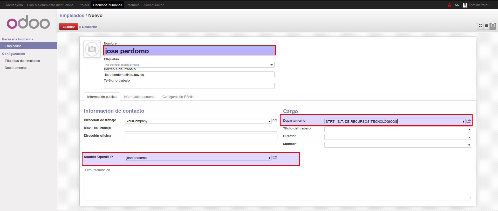

[[
title: Documento de diseño de Alto Nivel del Proceso Registro y Seguimiento Planes de Mejoramiento
author: José Javier Vargas Serrato
]]
Sistema de Seguimiento y Control a los Planes de Mejoramiento (SCPM)
===================================================================

Manual de usuario Super Admin
============================

[TOC]

Introducción
--------------------------------
En esta sección abordaremos algunas funcionalidades del usuario **Super Admin** en el sistema Odoo, este usuario es muy distinto al usuario **administrador** del módulo planes de mejoramiento. El primero abarca la parte administrativa del sistema Odoo en general, el segundo abarca la administración del módulo únicamente de planes de mejoramiento.

Las Funciones inmersas en los usuarios **OCI**, **Jefe Depemdencia**, **Ejecutor**, **Analista** y **Administración** del módulo planes de mejoramientos se encuentran  en el usuario **Super Admin** así que no hace falta volverlas a explicar. simplemente para obtener esta información ir a los siguientes link.

[Usuarios OCI](/planes_de_mejoramiento/documentacion/usuario_oci.html)

[Usuarios Jefe Dependencia](/planes_de_mejoramiento/documentacion/usuario_jefed.html)

[Usuarios Ejecutor](/planes_de_mejoramiento/documentacion/usuario_ejecutor.html)

[Usuarios Analista](/planes_de_mejoramiento/documentacion/usuario_analista.html)

[Usuarios Administrador](/planes_de_mejoramiento/documentacion/usuario_administradro.html)

En efectos del usuario **Super Admin** abordaremos la creación de usuarios.

## Creación de Usuarios.
Para crear un usuario damos click en el menú **Configuración**, luego en el menú de la izquierda damos click en el opción de **Usuarios**, nos aparecerá la ventana de usuarios; en este damos click en **Crear**.

Nos proporcionará un formulario para registrar los datos del usuarios.  lo más básico  y esencial es el nombre, Dirección de correo electrónico y el rol al cual pertenece en el módulo de planes de mejoramiento.

En el campo nombre, proporcionamos el nombre  completo del usuario.

En el campo correo electrónico ingresar el usuario del directorio activo del  IDU, la siguiente imagen nos muestra el ingreso de datos básicos.

haciendo scroll, veremos la sección donde seleccionamos el rol para planes de mejoramiento.

Click en Guardar. Automáticamente algunos campos se diligenciaran como por ejemplo **Empresa relacionada**

A este le damos click y el aplicativo nos dirigirá a un formulario en el cual diligenciamos el campo **Email** con el correo institucional del usuario.

Una vez creado el usuario debemos crear un **Empleado** asociado a este. Para ello click en el módulo **Recursos Humanos**, click en el menú de la derecha que dice **Empleados** y luego en el botón **Crear**

Se nos despliega un formulario para crear un empleado. Lo importante de este formulario a diligenciar es el campo **Nombre**, **Usuario OpenERP**, y **Departamento**.

El campo nombre debe ser igual al nombre ingresado en el formulario de creación de usuario.

En el campo Usuario OpenERP seleccionamos de la lista desplegable el usuario creado.

En el campo Departamento seleccionamos de la lista desplegable el área al cual pertenece el usuario.

Click en **Guardar** para finalizar.
