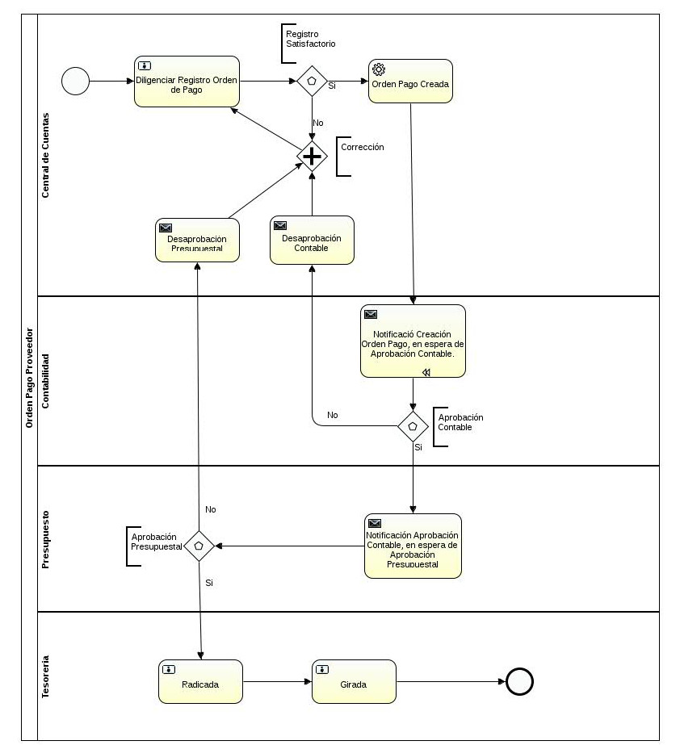
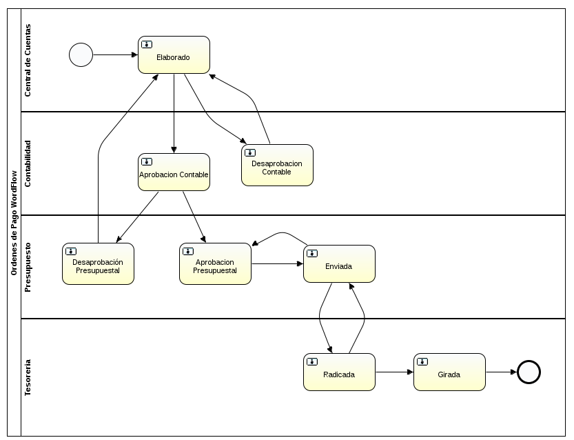
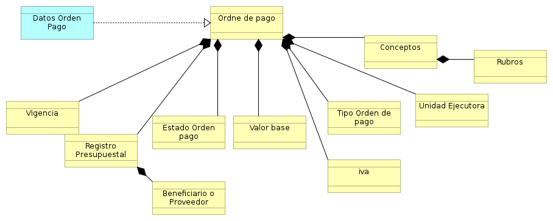

[[
title: Documento de análisis del Proceso de Registro de las Ordenes de Pago
author: José Javier Vargas Serrato
]]

Análisis de Actividades
=======================

Registro y seguimiento Giro Ordenes de Pago
==========================

[TOC]

Introducción
------------

Los giros de las órdenes de pago es la  actividad final en el [workflo de la orden de pago](/Kronos/orden_pago/analisis/analisis_actividades.html#workflow).

En esta actividad se selecciona una o varias órdenes para ser procesadas y generen un movimiento contable que permitirá a la entidad bancaria finalmente realizar el pago a cada uno de los involucrados en cada una de las órdenes de pago seleccionada.

Definición del Proceso
----------------------

Un módulo en el cual se pueda seleccionar una o varias órdenes de pago en estado Radicada, se genere el cambio de estado de **Radicada** a  **Girado**, se generen los respectivos documentos con las estructura pertinente para la entidad bancaria encargada de realizar los pagos a los beneficiarios.

Entidades Identificadas
-----------------------------------------------

Son las entidades que interactúan con el proceso o forman parte del mismo.

**Orden de Pago**:

**Cuenta Bancaria**:

Modelo y Notación de Procesos de Negocio (BPMN)
-----------------------------------------------

Descripción de las Actividades del proceso
------------------------------------------
### Actividad 1: Diligenciar Registro Orden de Pago.

* Tarea 1.0: Realizar el ingreso pertinente de datos  para registrar la orden de pago.

* Tarea 1.1: Valirdar datos obligatorios y controles de campos.

* Tarea 1.2: Notificar Registro exitoso o fallido.

### Actividad 2: Orden de pago Registrada.

* Tarea 2.0 : El sistema registrará los valores por concepto por los cuales realizó la orden de pago y  las cuentas contable que fueron afectadas.

### Actividad 3: Notificación Creación Orden de Pago, en Espera de Aprobación Contable.

* Tarea 3.0: El sistema notificará por medio de un correo electrónico la creación de la orden de pago al usuario contabilidad.

### Actividad 4: Desaprobación Contable.

* Tarea 4.0 :El sistema notificará por medio de un correo electrónico al usuario central de cuentas la  desaprobación contable por parte del usuario contabilidad.

### Actividad 5: Notificación Aprobación Contable, en Espera de Aprobación Presupuestal.

* Tarea 5.0: El sistema notificará por medio de un correo electrónico la aprobación contable al usuario presupuesto.

### Actividad 6: Radicada.

* Tarea 6.0: El usuario tesorería cambiará el estado de la orden de pago a radicada.

### Actividad 7: Desaprobación Presupuestal.

* Tarea 7.0: El sistema notifica por medio  de un correo electrónico la desaprobación presupuestal al usuario central de cuentas.

### Actividad 8: Girada.

* Tarea 8.0: El usuario tesorería cambiará el estado de la orden de pago de radicada a girada.

Workflow
-----------------------------------------------

### Elaborado:

* **Validación**: Verifica que los campos requeridos para realizar la orden estén previamente diligenciados.
* **Grupo o rol**: central de cuenta.
* **Acción disparadores/trigger**: Al realizar registros el registro de la orden de pago el estado por defecto es elaborado.

### Aprobación Contable:
* **Validación**: Ninguna.
* **Grupo o rol**: Contabilidad.
* **Acción disparadores/trigger**: Acción manual, al usuario contabilidad cambia el estado de elaborado a Aprobado Contable.

### Desaprobación Contable:

* **Validación**: Ninguna.
* **Grupo o rol**: Contabilidad.
* **Acción disparadores/trigger**: Acción manual, al usuario contabilida cambia el estado de elaborado a Desaprobación Contable.

### Desaprobación Presupuestal:
* **Validación**: Ninguna.
* **Grupo o rol**: Presupuesto.
* **Acción disparadores/trigger**: Acción manual, al usuario Presupuesto cambia el estado de Aprobación Contable  a Desaprobación Presupuestal.

### Aprobación Presupuestal:
* **Validación**: Ninguna.
* **Grupo o rol**: Presupuesto.
* **Acción disparadores/trigger**: Acción manual, al usuario Presupuesto cambia el estado de Aprobación Contable  a Aprobación Presupuestal.

### Enviada:
* **Validación**: Ninguna.
* **Grupo o rol**: Presupuesto.
* **Acción disparadores/trigger**: Acción manual, al usuario Presupuesto cambia el estado de Aprobación Presupuestal a Validado.

### Radicada:
* **Validación**: Ninguna.
* **Grupo o rol**: Tesorería.
* **Acción disparadores/trigger**: Acción manual, al usuario Tesorería cambia el estado de Enviada a Radicada.

### Girada:
* **Validación**: Ninguna.
* **Grupo o rol**: Tesorería.
* **Acción disparadores/trigger**: Acción manual, al usuario Tesorería cambia el estado de  Radicada la Girada.

Arquitectura de información
-----------------------------------------------

