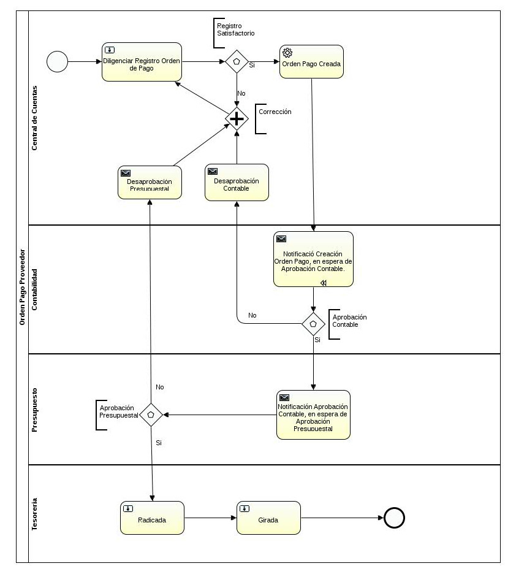
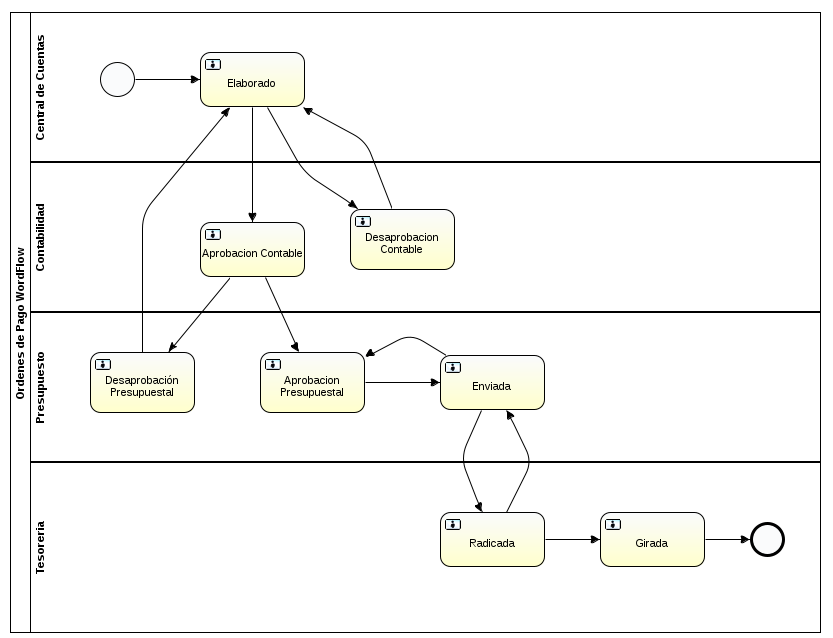
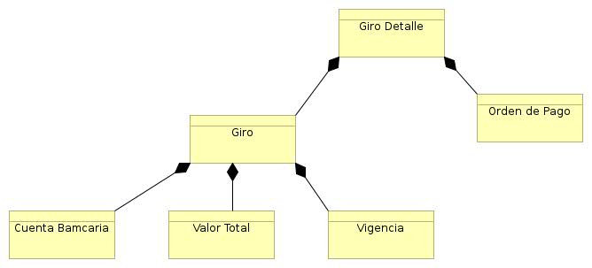

[[
title: Documento de análisis del Proceso de Registro de las Ordenes de Pago
author: José Javier Vargas Serrato
]]

Análisis de Actividades
=======================

Registro y seguimiento Giro Ordenes de Pago
==========================

[TOC]

Introducción
------------

Los giros de las órdenes de pago es la  actividad final en el [workflo de la orden de pago](/Kronos/orden_pago/analisis/analisis_actividades.html#workflow).

En esta actividad se selecciona una o varias órdenes para ser procesadas y generen un movimiento contable que permitirá a la entidad bancaria finalmente realizar el pago a cada uno de los involucrados en cada una de las órdenes de pago seleccionada.

Definición del Proceso
----------------------

Un módulo en el cual se pueda seleccionar una o varias órdenes de pago en estado Radicada, se genere el cambio de estado de **Radicada** a  **Girado**, se generen los respectivos documentos con las estructura pertinente para la entidad bancaria encargada de realizar los pagos a los beneficiarios.

Entidades Identificadas
-----------------------------------------------

Son las entidades que interactúan con el proceso o forman parte del mismo.

**Tesoreria (Actor)**: Usuario encargado de ejecutar el estado girada de las órdenes de pago.

Modelo y Notación de Procesos de Negocio (BPMN)
-----------------------------------------------

Descripción de las Actividades del proceso
------------------------------------------
### Actividad 8: Girada.

* Tarea 8.0: El usuario tesorería cambiará el estado de la orden de pago de radicada a girada.

Workflow
-----------------------------------------------

### Girada:
* **Validación**: Ninguna.
* **Grupo o rol**: Tesorería.
* **Acción disparadores/trigger**: Acción manual, al usuario Tesorería cambia el estado de  Radicada la Girada.

Arquitectura de información
-----------------------------------------------

