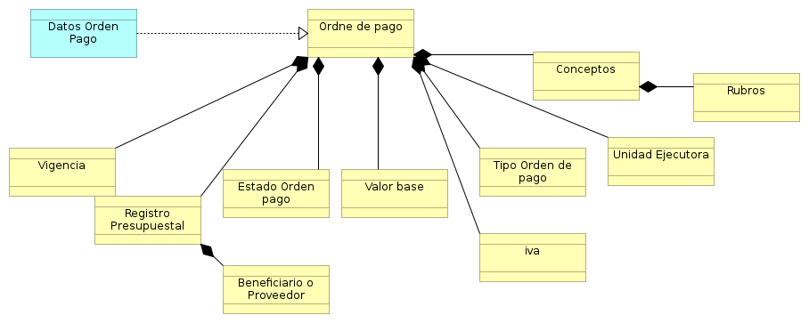

[[
title: Documento de análisis del Proceso de Registro de las Ordenes de Pago
author: José Javier Vargas Serrato
]]

Análisis de Actividades
=======================

Registro y seguimiento Ordense de Pago
==========================

[TOC]

Introducción
------------

La orden de pago es el instrumento por medio del cual una entidad pone a disposición de un beneficiario una suma de dinero por efecto de pago de productos o servicios. La orden de pago pueden clasificarse  por el tipo de nómina del beneficiario al cual se le dispone el dinero.

Dado los tipos de nóminas al interior de la Universidad Distrital, podemos especificar tipos de Órdenes de pago que se efectúan para estas nóminas.

**Orden de Pago Proveedor O Contratista**:  Las órdenes de pago denominadas proveedor son las que se le realizan a empleados en la modalidad de contratación de prestación de servicio (CPS), los cuales brindan su talento humano a la entidad.
También son las que se le realizan a empresas que brindan sus servicios o productos específico; un ejemplo puede ser CODENSA, que ofrece el servicios de agua, o empresas que venden productos como computadores, tableros, mesas, etc. Todos estos son beneficiarios los cuales por pago de sus producto o servicios la entidad que los obtenga realizará órdenes de pago de proveedores.

**Orden de Pago Planta**:

**Orden de Pago Pensionados**:

**Orden de Pago Hora Cátedra**:

**Orden de Pago Hora Proveedores**:

Definición del Proceso
----------------------

Un módulo de registro de órdenes de pago, que sustente periódicamente el pago de la entidad u organización a un beneficiario "tercero" por efecto de productos o servicios.

Entidades Identificadas (Responsables y tareas)
-----------------------------------------------

Son las entidades que interactúan con el proceso o forman parte del mismo.

Modelo y Notación de Procesos de Negocio (BPMN)
-----------------------------------------------

Descripción de las Actividades del proceso
------------------------------------------
### Actividad 1: Diligenciar Registro Orden de Pago.

* Tarea 1.0: Realizar el ingreso pertinente de datos  para registrar la orden de pago.

* Tarea 1.1: Valirdar datos obligatorios y controles de campos.

* Tarea 1.2: Notificar Registro exitoso o fallido.

### Actividad 2: Orden de pago Registrada.

* Tarea 2.0 : El sistema registrará los valores por concepto por los cuales realizó la orden de pago y  las cuentas contable que fueron afectadas.

### Actividad 3: Notificación Creación Orden de Pago, en Espera de Aprobación Contable.

* Tarea 3.0: El sistema notificará por medio de un correo electrónico la creación de la orden de pago al usuario contabilidad.

### Actividad 4: Desaprobación Contable.

* Tarea 4.0 :El sistema notificará por medio de un correo electrónico al usuario central de cuentas la  desaprobación contable por parte del usuario contabilidad.

### Actividad 5: Notificación Aprobación Contable, en Espera de Aprobación Presupuestal.

* Tarea 5.0: El sistema notificará por medio de un correo electrónico la aprobación contable al usuario presupuesto.

### Actividad 6: Radicada.

* Tarea 6.0: El usuario tesorería cambiará el estado de la orden de pago a radicada.

### Actividad 7: Desaprobación Presupuestal.

* Tarea 7.0: El sistema notifica por medio  de un correo electrónico la desaprobación presupuestal al usuario central de cuentas.

### Actividad 8: Girada.

* Tarea 8.0: El usuario tesorería cambiará el estado de la orden de pago de radicada a girada.

Workflow
-----------------------------------------------

### Elaborado:

* **Validación**: Verifica que los campos requeridos para realizar la orden estén previamente diligenciados.
* **Grupo o rol**: central de cuenta.
* **Acción disparadores/trigger**: Al realizar registros el registro de la orden de pago el estado por defecto es elaborado.

### Aprobación Contable:
* **Validación**: Ninguna.
* **Grupo o rol**: Contabilidad.
* **Acción disparadores/trigger**: Acción manual, al usuario contabilidad cambia el estado de elaborado a Aprobado Contable.

### Desaprobación Contable:

* **Validación**: Ninguna.
* **Grupo o rol**: Contabilidad.
* **Acción disparadores/trigger**: Acción manual, al usuario contabilida cambia el estado de elaborado a Desaprobación Contable.

### Desaprobación Presupuestal:
* **Validación**: Ninguna.
* **Grupo o rol**: Presupuesto.
* **Acción disparadores/trigger**: Acción manual, al usuario Presupuesto cambia el estado de Aprobación Contable  a Desaprobación Presupuestal.

### Aprobación Presupuestal:
* **Validación**: Ninguna.
* **Grupo o rol**: Presupuesto.
* **Acción disparadores/trigger**: Acción manual, al usuario Presupuesto cambia el estado de Aprobación Contable  a Aprobación Presupuestal.

### Enviada:
* **Validación**: Ninguna.
* **Grupo o rol**: Presupuesto.
* **Acción disparadores/trigger**: Acción manual, al usuario Presupuesto cambia el estado de Aprobación Presupuestal a Validado.

### Radicada:
* **Validación**: Ninguna.
* **Grupo o rol**: Tesorería.
* **Acción disparadores/trigger**: Acción manual, al usuario Tesorería cambia el estado de Enviada a Radicada.

### Girada:
* **Validación**: Ninguna.
* **Grupo o rol**: Tesorería.
* **Acción disparadores/trigger**: Acción manual, al usuario Tesorería cambia el estado de  Radicada la Girada.

Arquitectura de información
-----------------------------------------------

