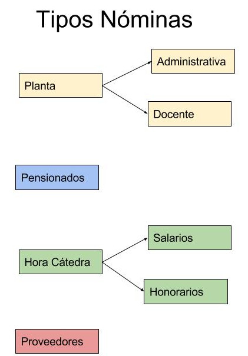

[[
title: Documento de análisis del Proceso de Registro de las Ordenes de Pago
author: José Javier Vargas Serrato
]]

Análisis de Actividades
=======================

Registro y seguimiento Ordense de Pago
==========================

[TOC]

Introducción
------------

La orden de pago es el instrumento por medio del cual una entidad pone a disposición de un beneficiario una suma de dinero por efecto de pago de productos o servicios. La orden de pago pueden clasificarse  por el tipo de nómina del beneficiario al cual se le dispone el dinero.

Dado los tipos de nóminas al interior de la Universidad Distrital, podemos especificar tipos de Órdenes de pago que se efectúan para estas nóminas.

**Orden de Pago Proveedor O Contratista**:  Las órdenes de pago denominadas proveedor son las que se le realizan a empleados en la modalidad de contratación de prestación de servicio (CPS), los cuales brindan su talento humano a la entidad.
También son las que se le realizan a empresas que brindan sus servicios o productos específico; un ejemplo puede ser CODENSA, que ofrece el servicios de agua, o empresas que venden productos como computadores, tableros, mesas, etc. Todos estos son beneficiarios los cuales por pago de sus producto o servicios la entidad que los obtenga realizará órdenes de pago de proveedores.

**Orden de Pago Planta**:
**Orden de Pago Pensionados**:
**Orden de Pago Hora Cátedra**:
**Orden de Pago Hora Proveedores**:

Definición del proceso
----------------------

Un módulo de registro de órdenes de pago, que sustente periódicamente el pago de la entidad u organización a un beneficiario "tercero" por efecto de productos o servicios.

Entidades Identificadas (Responsables y tareas)
-----------------------------------------------

Son las entidades que interactúan con el proceso o forman parte del mismo.

Modelo y Notación de Procesos de Negocio (BPMN)
-----------------------------------------------

Descripción de las Actividades del proceso
------------------------------------------
### Actividad 1: Registrar Plan de Mejoramiento formulado y asignar el área responsable y corresponsable.

* Tarea 1.1: Realizar el registro de los planes de mejoramiento formulados por cada área
* Tarea 1.2: Asignar la áreas responsables y corresponsables del Plan de Mejoramiento registrado.
* Tarea 1.3: Informar a las áreas de la asignación del Plan de Mejoramiento.

### Actividad 2: Dar por informados las áreas responsables y corresponsables y asignar de funcionarios encargados de reportar la información de avance.

* Tarea 1.1: Aceptar el Plan de Mejoramiento asignado.
* Tarea 1.2: Asignar encargado de reportar información de avance sobre las actividades.

### Actividad 3: Registrar mensualmente los avances por actividad.

* Tarea 1.1: Realizar el registro mensual de avance por actividad formulada en el Plan de mejoramiento.
* Tarea 1.2: Reportar evidencias que soporten los registros de avance.
* Tarea 1.3: Informar al directivo del área sobre los registros de avance y evidencias reportadas.

### Actividad 4: Dar visto bueno por parte del directivo del área sobre el registro mensual de los avances por actividad.

* Tarea 1.1:  Revisar el registro mensual de avance por actividad formulada en el Plan de mejoramiento.
* Tarea 1.2: Aprobar el registro mensual de avance por actividad.

### Actividad 5: Revisar por parte de la OAP los avances reportados por las áreas y registrar las observaciones al proceso.

* Tarea 1.1: Revisar mensualmente los registros de avance aprobados por el directivo del área.
* Tarea 1.2: Registrar observaciones a los avances reportados.

### Actividad 6: Revisar por parte de la OCI los avances reportados por las áreas y tener en cuenta las observaciones al proceso realizadas por la OAP, para el monitoreo, registro de observaciones al seguimiento del proceso y  con calificativo de avance.

* Tarea 1.1: Revisar mensualmente las observaciones realizadas por la OAP y los registros de avance aprobados por el directivo del área.
* Tarea 1.2: Registrar observaciones a los avances reportados.
* Tarea 1.3: Realizar monitoreo a los avances de los Planes de Mejoramiento de las áreas.
* Tarea 1.4: Indicar porcentaje de avance por cada actividad formulada en el Plan de Mejoramiento teniendo en cuenta metodología de los entes de control.

### Actividad 7: Generar reportes e informes de los planes de mejoramiento.

* Tarea 1.1: Generar reporte de seguimiento (matriz consolidada de lo abierto es decir que la Contralorías no han dado cierre todavía).
* Tarea 1.2: Generar reporte de avance en los planes de mejoramiento (Matriz consolidada con indicadores de avance para cada acción y/o actividad).
* Tarea 1.3: Generar históricos (por hallazgo y/o actividad. Trazabilidad del avance y cumplimiento).
* Tarea 1.4: Generar reportes con destino externo según formato y metodología de cada ente de control.
* Tarea 1.5: Generar informe por área responsable.
* Tarea 1.6: Generar reportes de alertas tempranas, en cuanto avances, plazos y demás criterios para contribuir con el cumplimiento de los planes de mejoramiento, dentro de sus roles de evaluación y seguimiento y asesoría.

### Actividad 8: Solicitar reformulación  de actividades por parte del área y aprobación por parte del DG y OCI.

* Tarea 1.1: Registrar la solicitud de reformulación de las actividades formuladas para cumplimiento de la actividad.
* Tarea 1.2: Justificar la solicitud de reformulación de las actividades y/o fechas.
* Tarea 1.3: Aprobar la solicitud de reformulación.

### Actividad 9: Registrar estado de la actividad a la fecha de compromiso de cumplimiento.

* Tarea 1.1: Revisar los porcentajes de avance registrados por actividad.
* Tarea 1.2: Revisar el último reporte de avance sobre la actividad.
* Tarea 1.3: Asignar el estado de la actividad a la fecha de compromiso de cumplimiento.

### Actividad 10: Definir el estado de la actividad al cierre según concepto del ente de control.

* Tarea 1.1: Revisar el estado de la actividad a la fecha de compromiso de cumplimiento.
* Tarea 1.2: Revisar los porcentajes de avance registrados por actividad.
* Tarea 1.3: Revisar el último reporte de avance sobre la actividad.
* Tarea 1.4: Asignar estado de la actividad al cierre según concepto del ente del control.

### Actividad 11: Generar alertas.

* Tarea 1.1: Enviar correo electrónico del jefe del área, a la OAP y a la OCI de las actividades vencidas, próximas a vencerse y/o sin reporte.
* Tarea 1.2: Enviar al correo del Jefe de área responsable de las fechas establecidas para reporte, en cada periodo.

Relación de Actividades: Entradas – Proceso – Salidas
-----------------------------------------------------

Entorno y Restricciones
-----------------------

Aquellos elementos externos al proceso, que se consideran dados, pero no obstante afectan su comportamiento.

**Elementos del Entorno**
- Informe definitivo de observaciones por parte de los ente de control.
Plan de Mejoramiento formulado.

**Restricciones**
- Plan de Mejoramiento mal formulado.
- Registro fuera de los tiempos de los avances realizados sobre la actividad.
- No cumplimiento de los compromisos registrados en el Plan de  Mejoramiento.
