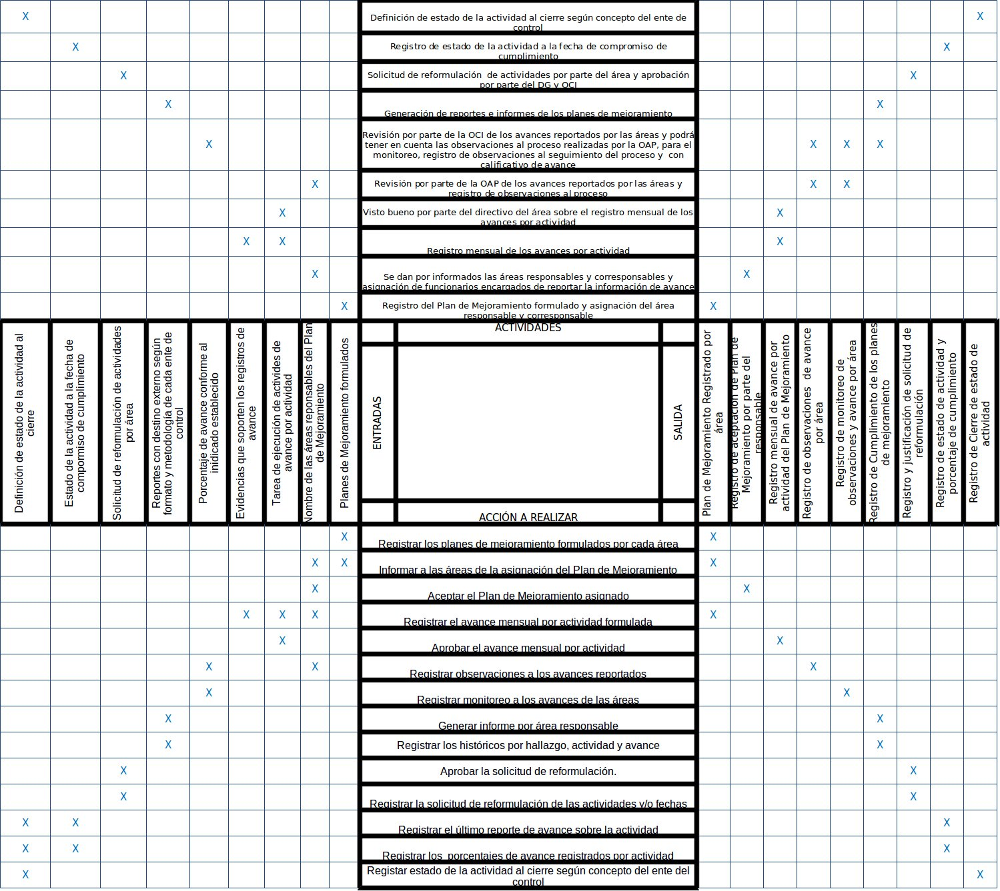

[[
title: Documento de análisis de Actividades del Proceso Registro y Seguimiento Planes de Mejoramiento
author: José Javier Vargas Serrato
]]

Análisis de Actividades
=======================

Registro y seguimiento Planes de Mejoramiento
==========================

[TOC]

Introducción
------------

La formulación de los planes de mejoramiento es el instrumento para desarrollar acciones que permitan el mejoramiento continuo en los procesos del instituto, a través de metas específicas. Las acciones que sean formuladas deben estar orientadas a prevenir, detectar y corregir la ocurrencia de las causas que generaron las situaciones identificadas de manera interna o externa.

La Oficina de Control Interno – OCI, monitorea y evalúa la ejecución y el avance de los planes de mejoramiento para asegurar su efectivo cumplimiento y la Implementación de las acciones de mejoramiento conforme con lo formulado; Igualmente realiza acompañamiento suministrando asesoría en la formulación de los planes de mejoramiento en lo referente a la metodología, teniendo en cuenta que la responsabilidad de la formulación y cumplimiento de las acciones es del área o áreas identificadas como responsables.

La Oficina Asesora de Planeación – OAP, realiza el seguimiento periódico a la ejecución de los planes de mejoramiento con los organismos de control de acuerdo con las funciones a cargo. Las dependencias podrán solicitar a la OAP acompañamiento y asesoría en el proceso de formulación del plan de mejoramiento y ésta a su vez podrá realizar seguimiento y apoyar a las áreas en la ejecución de las actividades.

Al finalizar la ejecución de cada Plan de Mejoramiento, la Oficina de Control Interno realizará una evaluación de la efectividad de las acciones formuladas con el fin de determinar el cierre de los hallazgos y acciones asociadas. Esta actividad se realizará mínimo una vez al año, conforme a la programación que establezca la Oficina de Control Interno.

Definición del proceso
----------------------

Un sistema de registro de las acciones, actividades y demás atributos que conforman el Plan de Mejoramiento definido por la Entidad, así como el avance, acompañamiento, seguimiento, evaluación y monitoreo de dichas acciones; que sirva como herramienta para el establecimiento de mecanismos de control, alertas tempranas, observaciones y recomendaciones que permitan garantizar la efectividad en su cumplimiento.

Entidades Identificadas (Responsables y tareas)
-----------------------------------------------

Son las entidades que interactúan con el proceso o forman parte del mismo.

### Áreas Responsables (Cliente)
Área a la que le corresponde liderar la ejecución de las acciones del Plan de Mejoramiento.Se relacionan con el sistema mediante el registro del avance de las acciones a su cargo del plan de mejoramiento consolidando el reporte de las áreas corresponsables y el propio.

### Áreas Corresponsables (Cliente)
Área de apoyo en la ejecución de las acciones del Plan de Mejoramiento.Se relacionan con el sistema mediante el registro del avance de las acciones de las cuales son corresponsables del plan de mejoramiento.

### Oficina Asesora de Planeación – OAP (Actor)
Área que realiza el acompañamiento a las áreas responsables y corresponsables con el fin de contribuir con el éxito de plan de mejoramiento minimizando el riesgo, generando alertas tempranas y participando activamente en la conciliación entre las áreas. Se relacionan con el sistema mediante la consulta de los registros de las áreas responsables, corresponsables y la OCI. Podrá solicitar a las áreas responsables y corresponsables la ampliación de la información y generación de reportes.

### Oficina de Control Interno – OCI (Actor)
Área responsable del monitoreo, seguimiento y la evaluación de las acciones y del plan de mejoramiento. Podrá realizar labores de asesoría a todas las partes interesadas en todas las fases del plan de mejoramiento con el fin de aportar información para las formulaciones y ajustes de acciones. Dentro del contexto metodológico de los entes de control, sin comprometer su independencia. En su rol de relación con los entes externos, tiene a cargo la relación y comunicación directa con los organismos de control y sirve como enlace y puente en la gestión y documentación de avance y cumplimiento con los organismos de control.

### CCCI o su similar (Actor)
Hacer recomendaciones al plan de mejoramiento teniendo en cuenta el seguimiento y acompañamiento de las OAP y los informes preparados por la OCI. Se relacionan con el sistema mediante la generación de reportes.

### Dirección General – DG (Propietario)
Responsable del plan de mejoramiento con los organismos de control en su conjunto. Su rol es de seguimiento y apoyo especial a aquellas actividades complejas y/o que requieran de la participación de otras entidades. Se relacionan con el sistema mediante la generación de reportes y consulta de los registros de las áreas responsables, corresponsables, la OAP y la OCI.

Diagrama de actividades
-----------------------
{uml}

	title Diagrama de actividades\nRegistro y seguimiento Planes de Mejoramiento
	(*) --> "Registrar\nPlan de Mejoramiento"
	-right-> "Asignar responsables\n y corresponsables "
	--> "Dar visto bueno por parte\nde las áreas responsables\ny corresponsables"
	--> "Asignar funcionario encargado\ndel reporte de avance"
	--> "Registrar avances\npor actividad"
	note left: Esta actividad debe\nrealizarse mensualmente
	--> "Aprobar los avances\npor actividad"
	--> "Evaluar el cumplimiento\ndel Plan de Mejoramiento"
	--> (*)
	header
	Designed by STRT I+D+I
	end header

{enduml}

Descripción de las Actividades del proceso
------------------------------------------
### Actividad 1: Registrar Plan de Mejoramiento formulado y asignar el área responsable y corresponsable.

* Tarea 1.1: Realizar el registro de los planes de mejoramiento formulados por cada área
* Tarea 1.2: Asignar la áreas responsables y corresponsables del Plan de Mejoramiento registrado.
* Tarea 1.3: Informar a las áreas de la asignación del Plan de Mejoramiento.

### Actividad 2: Dar por informados las áreas responsables y corresponsables y asignar de funcionarios encargados de reportar la información de avance.

* Tarea 1.1: Aceptar el Plan de Mejoramiento asignado.
* Tarea 1.2: Asignar encargado de reportar información de avance sobre las actividades.

### Actividad 3: Registrar mensualmente los avances por actividad.

* Tarea 1.1: Realizar el registro mensual de avance por actividad formulada en el Plan de mejoramiento.
* Tarea 1.2: Reportar evidencias que soporten los registros de avance.
* Tarea 1.3: Informar al directivo del área sobre los registros de avance y evidencias reportadas.

### Actividad 4: Dar visto bueno por parte del directivo del área sobre el registro mensual de los avances por actividad.

* Tarea 1.1:  Revisar el registro mensual de avance por actividad formulada en el Plan de mejoramiento.
* Tarea 1.2: Aprobar el registro mensual de avance por actividad.

### Actividad 5: Revisar por parte de la OAP los avances reportados por las áreas y registrar las observaciones al proceso.

* Tarea 1.1: Revisar mensualmente los registros de avance aprobados por el directivo del área.
* Tarea 1.2: Registrar observaciones a los avances reportados.

### Actividad 6: Revisar por parte de la OCI los avances reportados por las áreas y tener en cuenta las observaciones al proceso realizadas por la OAP, para el monitoreo, registro de observaciones al seguimiento del proceso y  con calificativo de avance.

* Tarea 1.1: Revisar mensualmente las observaciones realizadas por la OAP y los registros de avance aprobados por el directivo del área.
* Tarea 1.2: Registrar observaciones a los avances reportados.
* Tarea 1.3: Realizar monitoreo a los avances de los Planes de Mejoramiento de las áreas.
* Tarea 1.4: Indicar porcentaje de avance por cada actividad formulada en el Plan de Mejoramiento teniendo en cuenta metodología de los entes de control.

### Actividad 7: Generar reportes e informes de los planes de mejoramiento.

* Tarea 1.1: Generar reporte de seguimiento (matriz consolidada de lo abierto es decir que la Contralorías no han dado cierre todavía).
* Tarea 1.2: Generar reporte de avance en los planes de mejoramiento (Matriz consolidada con indicadores de avance para cada acción y/o actividad).
* Tarea 1.3: Generar históricos (por hallazgo y/o actividad. Trazabilidad del avance y cumplimiento).
* Tarea 1.4: Generar reportes con destino externo según formato y metodología de cada ente de control.
* Tarea 1.5: Generar informe por área responsable.
* Tarea 1.6: Generar reportes de alertas tempranas, en cuanto avances, plazos y demás criterios para contribuir con el cumplimiento de los planes de mejoramiento, dentro de sus roles de evaluación y seguimiento y asesoría.

### Actividad 8: Solicitar reformulación  de actividades por parte del área y aprobación por parte del DG y OCI.

* Tarea 1.1: Registrar la solicitud de reformulación de las actividades formuladas para cumplimiento de la actividad.
* Tarea 1.2: Justificar la solicitud de reformulación de las actividades y/o fechas.
* Tarea 1.3: Aprobar la solicitud de reformulación.

### Actividad 9: Registrar estado de la actividad a la fecha de compromiso de cumplimiento.

* Tarea 1.1: Revisar los porcentajes de avance registrados por actividad.
* Tarea 1.2: Revisar el último reporte de avance sobre la actividad.
* Tarea 1.3: Asignar el estado de la actividad a la fecha de compromiso de cumplimiento.

### Actividad 10: Definir el estado de la actividad al cierre según concepto del ente de control.

* Tarea 1.1: Revisar el estado de la actividad a la fecha de compromiso de cumplimiento.
* Tarea 1.2: Revisar los porcentajes de avance registrados por actividad.
* Tarea 1.3: Revisar el último reporte de avance sobre la actividad.
* Tarea 1.4: Asignar estado de la actividad al cierre según concepto del ente del control.

### Actividad 11: Generar alertas.

* Tarea 1.1: Enviar correo electrónico del jefe del área, a la OAP y a la OCI de las actividades vencidas, próximas a vencerse y/o sin reporte.
* Tarea 1.2: Enviar al correo del Jefe de área responsable de las fechas establecidas para reporte, en cada periodo.

Relación de Actividades: Entradas – Proceso – Salidas
-----------------------------------------------------

Entorno y Restricciones
-----------------------

Aquellos elementos externos al proceso, que se consideran dados, pero no obstante afectan su comportamiento.

**Elementos del Entorno**
- Informe definitivo de observaciones por parte de los ente de control.
Plan de Mejoramiento formulado.

**Restricciones**
- Plan de Mejoramiento mal formulado.
- Registro fuera de los tiempos de los avances realizados sobre la actividad.
- No cumplimiento de los compromisos registrados en el Plan de  Mejoramiento.
